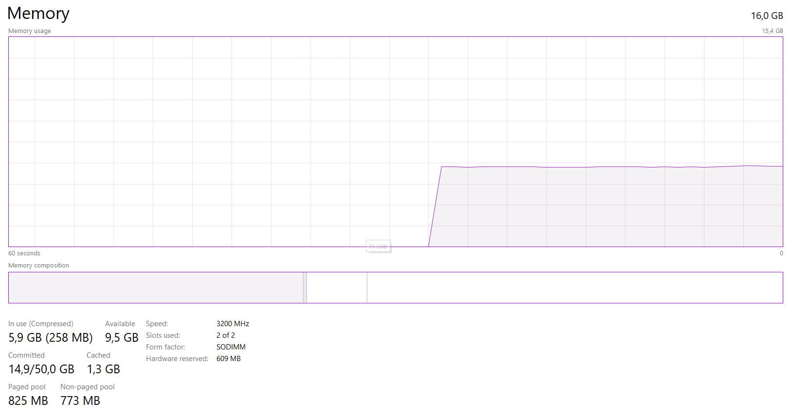

 **Tio Ezekiel**

 **2110131210018**

 **Tugas 2 Sistem Operasi**

 ><h1> Komponen Sistem Operasi</h1>

 <h2>1. Manajemen Proses</h2>

 Proses merupakan keadaan pada saat suatu program tengah di eksekusi. Sebuah proses juga membutuhkan sejumlah sumberdaya untuk dapat menyelesaikan tugasnya masing-masing. Sumber daya tersebut meliputi memori, perangkat Input dan Output, CPU time, dan berkas-berkas.

 

 Tanggung jawab sistem operasi dalam memanajemen proses seperti:
- Menunda maupun melanjutkan suatu proses.
- Menyediakan mekanisme yang dibutuhkan untuk proses dari sinkronisasi.
- Menyediakan mekanisme yang dibutuhkan untuk proses dari komunikasi.
- Menyediakan mekanisme yang dibutuhkan untuk proses penanganan pada deadlock.

<h2>2. Manajemen Memori Utama</h2>

