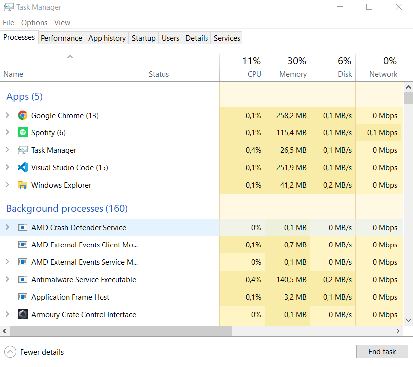
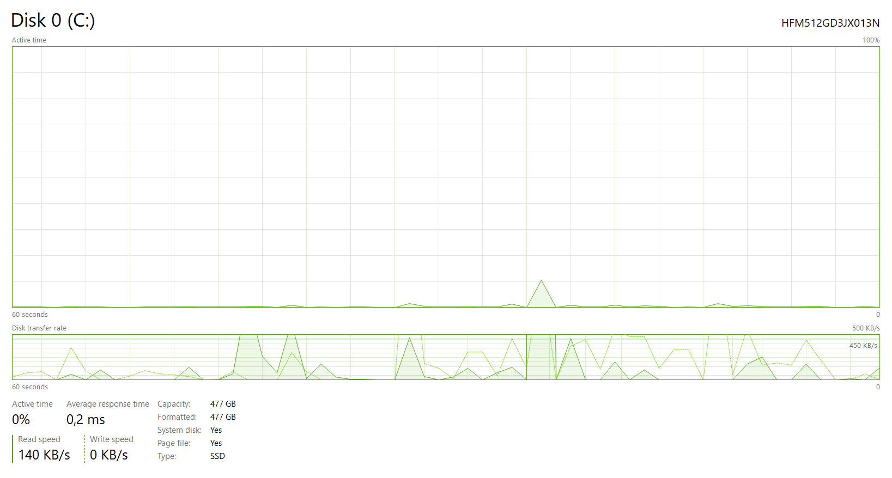

 
 ><h1> Komponen Sistem Operasi</h1>

 <h2>1. Manajemen Proses</h2>

 Proses merupakan keadaan pada saat suatu program tengah di eksekusi. Sebuah proses juga membutuhkan sejumlah sumberdaya untuk dapat menyelesaikan tugasnya masing-masing. Sumber daya tersebut meliputi memori, perangkat Input dan Output, CPU time, dan berkas-berkas.

 Tanggung jawab sistem operasi dalam memanajemen proses seperti:
- Menunda maupun melanjutkan suatu proses.
- Menyediakan mekanisme yang dibutuhkan untuk proses dari sinkronisasi.
- Menyediakan mekanisme yang dibutuhkan untuk proses dari komunikasi.
- Menyediakan mekanisme yang dibutuhkan untuk proses penanganan pada deadlock.

 

Gambar task manager di atas diambil dari laptop saya dan terlihat aplikasi yang sedang dibuka ada 5. Terlihat bahwa ada manajemen sumber daya yang dilakukan. Seperti berapa banyak persentase CPU, memory, disk yang dialokasikan untuk menjalankan aplikasi yang sedang terbuka tersebut. 
 

<h2>2. Manajemen Memori Utama</h2>

Memori utama juga sering disebut juga dengan memoriyaitu suatu array yang besar dari byte, dan ukurannya dapat mencapai ratusan, ribuan dan juga jutaan. Setiap byte memiliki alamatnya tersendiri.

Memori tersebut juga memiliki fungsi yaitu untuk menjadi tempat dari penyimpanan yang suatu akses datanya dapat digunakan oleh sebuah CPU maupun perangkat input dan output. Memori ini juga termasuk sebagai tempat penyimpanan yang volatile atau sementara. Hal itu berarti datanya dapat hilang pada saat sistemnya dimatikan.

Tanggung jawab sistem operasi pada manajemen memori yaitu:
- Dapat memilih program yang hendak di load ke dalam memori.
- Dapat mengalokasikan dan juga mengdealokasikan ruang memorinya yang disesuaikan degan kebutuhan.
- Dapat menjaga track dari memori yang tengah digunakan dan siapapun yang dapat menggunakannya.

<h2>3. Manajemen Secondary Memory</h2>

Data yang sudah disimpan kedalam memori utama memiliki sifat yang sementara dan juga jumlahnya dangatlah kecil. Maka dari itu, Untuk dapat menyimpan seluruh data dan juga program yang ada di komputer sangat dibutuhkan secondary-storage.

Dimana secondary-storage tersebut memiliki sifat yang permanen dan juga dapat menampung banyaknya data. Contoh dari secondary-storage yaitu seperti HDD, SSD, dan lain sebagainya.

Sistem operasi juga akan bertanggungjawab pada aktivitas yang berkaitan erat dengan disk managemen. Contohnya seperti alokasi penyimpanan, penjadwalan disk, dan juga free-space management.

