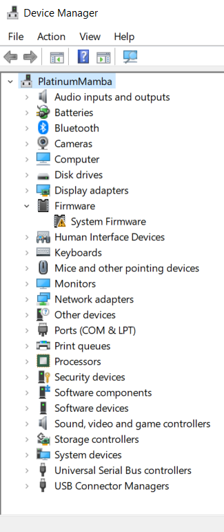

 
 ><h1> Komponen Sistem Operasi</h1>

 <h2>1. Manajemen Proses</h2>

 Proses merupakan keadaan pada saat suatu program tengah di eksekusi. Sebuah proses juga membutuhkan sejumlah sumberdaya untuk dapat menyelesaikan tugasnya masing-masing. Sumber daya tersebut meliputi memori, perangkat Input dan Output, CPU time, dan berkas-berkas.

 Tanggung jawab sistem operasi dalam memanajemen proses seperti:
- Menunda maupun melanjutkan suatu proses.
- Menyediakan mekanisme yang dibutuhkan untuk proses dari sinkronisasi.
- Menyediakan mekanisme yang dibutuhkan untuk proses dari komunikasi.
- Menyediakan mekanisme yang dibutuhkan untuk proses penanganan pada deadlock.

<p align="center"></p>

Gambar task manager di atas diambil dari laptop saya dan terlihat aplikasi yang sedang dibuka ada 5. Terlihat bahwa ada manajemen sumber daya yang dilakukan. Seperti berapa banyak persentase CPU, memory, disk yang dialokasikan untuk menjalankan aplikasi yang sedang terbuka tersebut. 
 

<h2>2. Manajemen Memori Utama</h2>

Memori utama juga sering disebut juga dengan RAM atau memori yaitu suatu array yang besar dari byte, dan ukurannya dapat mencapai ratusan, ribuan dan juga jutaan. Setiap byte memiliki alamatnya tersendiri.

Memori tersebut juga memiliki fungsi yaitu untuk menjadi tempat dari penyimpanan yang suatu akses datanya dapat digunakan oleh sebuah CPU maupun perangkat input dan output. Memori ini juga termasuk sebagai tempat penyimpanan yang volatile atau sementara. Hal itu berarti datanya dapat hilang pada saat sistemnya dimatikan.

Tanggung jawab sistem operasi pada manajemen memori yaitu:
- Dapat memilih program yang hendak di load ke dalam memori.
- Dapat mengalokasikan dan juga mengdealokasikan ruang memorinya yang disesuaikan degan kebutuhan.
- Dapat menjaga track dari memori yang tengah digunakan dan siapapun yang dapat menggunakannya.

<p align="center"></p>

Gambar di atas diambil dari tab performance di task manager. Terdapat informasi secara grafik maupun tertulis penggunaannya di situ.

Terlihat bahwa RAM digunakan sebesar 8,4gb, tersedia 6,8gb, slot ram digunakan 2 dari 2, kecepatan RAM 3200mhz dan masih banyak lagi yang lainnya.

<h2>3. Manajemen Sistem I/O</h2>

Managemen sistem Input dan output juga sering disebut dengan device manager. Hal ini juga akan menyediakan device driver yang biasa, yang mana nantinya operasi input dan output bisa seragam (membaca, membuka, menulis maupun menutup).

Contohnya yaitu pengguna dapat menggunakan operasi yang sama tersebut  untuk membaca suatu berkas yang ada pada hard disk, floppy disk, dan juga CD-ROM. Komponen pada manajemen sistem I/O ini yaitu :

- Spooling, hal ini dapat melakukan penjadwalan dari pemakaian sistem input maupun output agar dapat lebih efisien dan juga efektif.
- Buffer, hal ini dapat menampung sementara sejumlah data dari dan juga ke dalam perangkat input maupun output.
- Menyediakan suatu driver yang bisa melakukan operasi yang rinci untuk suatu hardware I/O tertentu.


<p align="center"></p>

Terlihat pada screenshot device manager dari laptop saya di atas terdapat beberapa perangkat Input Output yang terhubung dengan 

><h1>Layanan Sistem Operasi</h1>

<h2>1. Manipulasi Sistem Berkas</h2>

Salah satu layanan yang diberikan oleh sistem operasi adalah memanipulasi sistem berkas. Hal ini dapat dilakukan dengan File Explorer.

Dari File Explorer kita dapat memilih bagaimana ingin menggunakan berkas-berkas yang ada pada komputer. Sebagai contoh adalah dengan membuat sebuah folder. 

Berikut adalah contoh memanipulasi berkas dengan menggunakan File Explorer untuk membuat sebuah folder baru:

<p align="center"></p>


1. Klik kanan pada area kosong.
<p align="center"></p>


2. Arahkan cursor mouse ke tulisan New.
<p align="center"></p>


3. Pilih folder.
<p align="center"></p>


4. Beri nama folder. Folder pun berhasil dibuat.

<h2>2. Deteksi dan Pemberian Tanggapan Pada Kesalahan</h2>

Kegunaannya adalah untuk menjaga kestabilan sistem dengan mendeteksi "error", perangkat keras maupun operasi yang dilakukan.

Jika muncul permasalahan pada sistem komputer maka sistem operasi harus memberikan tanggapan yang menjelaskan kesalahan yang terjadi serta dampaknya terhadap aplikasi yang sedang berjalan.

<p align="center"></p>

Screenshot di atas diambil dari setting bagian troubleshoot. Apabila kita mendapat ada masalah pada perangkat maupun sistem, kita dapat melakukan troubleshoot. Troubleshooter akan mendeteksi masalah dan akan memberi opsi untuk memperbaikinya atau bahkan saran yang dapat kita lakukan untuk membantu ktia dalam mengatasi masalah.

Apabila masalah tidak dapat diselesaikan, troubleshooter biasanya akan mengarahkan untuk mencari solusi online.

<h2>3. Operasi Masukan/Keluaran</h2>

Operasi perangkat masukan/keluaran merupakan aspek perancangan sistem operasi terluas dan kompleks karena sangat beragamnya perangkat dan aplikasinya.

Salah satu kelompok perangkat I/O adalah yang beraliran data yang berorientasi aliran karakter. Yaitu perangkat yang menerima, dan mengirimkan aliran karakter tanpa
membentuk suatu struktur blok. Contohnya adalah **printer**.

<p align="center"></p>

><h1>System Call</h1>

Secara singkat system call atau syscall adalah sebuah instruksi, mirip dengan instruksi "add" atau "jump". Pada tingkat tinggi, sebuah system call adalah cara sebuah program pada level user untuk meminta pada sistem operasi untuk menjalankan sesuatu untuknya. Jika kita seorang programmer, dan kita membutuhkkan untuk membaca dari sebuah file, kita akan menggunakan system call untuk meminta sistem operasi untuk membaca file tersebut untuk kita.

Cara system call bekerja adalah sebagai berikut. Pertama-tama, user program akan mensetup argument untuk system call. Salah satu argumen adalah nomor system call. Perlu di catat bahwa semua ini dilakukan secara automatis oleh fungsi library kecuali jika kita menulis menggunakan bahasa assembler. Sesudah semua argumen di setup, program akan menjalankan instruksi "system call". Instruksi ini akan menyebabkan exception: event yang akan menyebabkan processor untuk jump ke satu address dan mulai menjalankan program / code di address tersebut.

Instruksi di alamat yang baru akan menyimpan state user program, menentukan sistem call apa yang kita inginkan, kemudian call fuction tersebut di kernel yang mengimplementasikan system call, setelah selesai maka mengembalikan program state, dan kembali ke user program. Sebuah system call adalah salah satu cara agar function yang di definisikan dalam device driver untuk bisa di panggil.

MS-DOS adalah contoh dari sistem single-tasking. MS-DOS menggunakan metoda yang sederhana dalam menjalankan program aan tidak menciptakan proses baru. Program di-load ke dalam memori, kemudian program dijalankan. 

Contoh sederhana penggunaan command line dengan sebuah command:

<p align="center"></p>

Dengan command 
```
chkdsk
```
, maka akan dilakukan pengecekan terhadap penyimpanan oleh sistem operasi untuk mendeteksi error/masalah pada file sistem. Pada screenshot di atas tertulis bahwa tidak ditemukan adanya masalah.