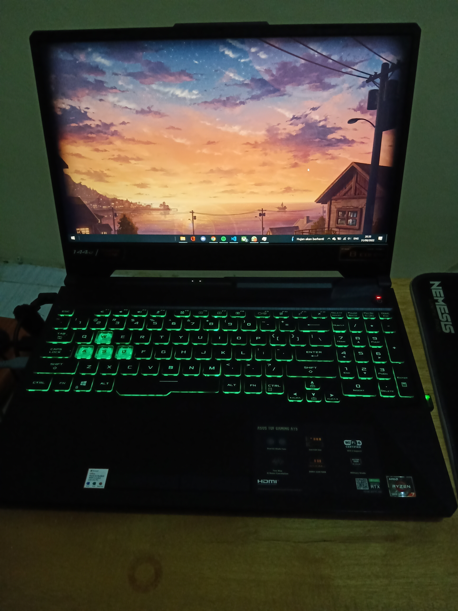
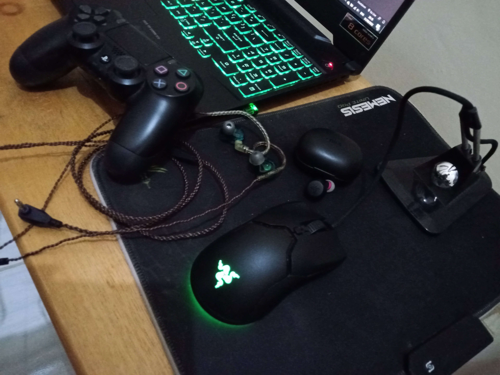
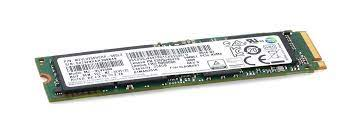

# Tugas Mendeskripsikan dengan Markdown

## Laptop

Laptop yang saya gunakan adalah ASUS TUF A15 berseri FA506QM. Berikut tampilan laptop yang saya gunakan: 

## Sistem Operasi

Sistem operasi yang saya gunakan adalah Windows 10 Home. Berikut spesifikasi lengkap sistem operasi laptop saya untuk sekarang:
- Edition	Windows 10 Home Single Language
- Version	21H2
- Installed on	‎19/‎07/‎2022
- OS build	19044.1889
- Experience	Windows Feature Experience Pack 120.2212.4180.0
Sistem operasi bermanfaat untuk menjadi jembatan antara hardware dan software juga kita sebagai user/pengguna.

## Prosesor

Laptop saya menggunakan prosesor dari AMD yaitu AMD Ryzen 7 5800H.
Prosesor berguna sebagai ...

## Software

Software yang sering saya gunakan ada berbagai macam. Contohnya seperti yang sedang ada di taskbar saya ini.

 

Dari kiri ke kanan terdapat File Explorer, Office, Discord, Chrome, Spotify, VSCode, Xbox, dan WhatsApp.

## Hardware

Dan berikut adalah hardware yang tidak bisa jauh dari saya: 

Terdapat mouse (Razer Viper Mini), stik (controller PS4), earset wired (KZ ZSN), earset wireless (Edifier X3s), mousepad (NYK Nemesis), mouse bungee (no brand), dan juga ada WiFi dongle (tp-link TL-WN725N). 
Hardware berguna untuk mendukung kerja komputer, menampilkan atau menerima input (masukan) proses, mengolah data/informasi, memberikan output, serta menyimpan data/informasi yang terpasang di dalam maupun di luar komputer.

## Penyimpanan

Penyimpanan laptop saya hanya ada satu yang ada di laptop ini yaitu SSD 512GB NVMe PCIe M2 bermerk hynix.

Penyimpanan atau storage berguna untuk menyimpan berbagai macam data digital yang tersedia pada perangkat komputer dengan waktu tertentu sehingga dapat dibaca dan dibuka kembali untuk diproses ulang pada perangkat.

&nbsp;

# Sejarah Komputer

**Sejarah Komputer** berawal dari abad ke-13, ketika seseorang bernama Charles Babbage mencoba untuk membuat komputer mekanik yang bernama Mesin Analitikal. Karya ini menjadi basis kerangka desain komputer hingga sekarang.

- **Generasi Pertama** dimulai ketika komputer digunakan dalam akademi dan militer, seperti komputer Alanasolf-Berry yang diciptakan pada tahun 1937 yang bertujuan untuk penyelesaian sistem persamaan linear dan komputer Colossus untuk memecahkan kode rahasia Nazi Jerman. Lalu, ENIAC (Electronic Numerical Integrator And Computer) yang dibangun pada tahun 1946 menjadi komputer yang pertama ditujukan untuk umum. Komputer pada generasi ini memanfaatkan tabung vakum untuk menyimpan data dan ukurannya memakan satu ruangan.
- **Generasi Kedua** dimulai ketika transistor menggantikan tabung vakum. UNIVAC (Universal Automatic Computer) diperkenalkan ke publik tahun 1951 untuk penggunaan komersial. Kemudian, pada tahun 1953, IBM memulai bisnis komputernya dengan merilis dua produk. Berbagai bahasa pemrograman mulai dikembangkan dan komputer mulai memiliki memori dan sistem operasi.
- **Generasi Ketiga** dimulai ketika teknologi transistor meningkat menjadi sirkuit terpadu. Komputer mini adalah inovasi yang signifikan dalam generasi ini dan memengaruhi generasi komputer selanjunya. NASA menggunakan komputer generasi ini untuk melancarkan Program Apollo.
- **Generasi Keempat** dimulai pada dasawarsa 1970-an ketika penemuan MOSFET (metal–oxide–semiconductor field-effect transistor) dan integrasi berskala besar selanjutnya membawa ke pengembangan mikroprosesor di awal 1970-an. komputer pribadi yang semakin kecil berkat mikroprosesor mulai berkembang, dimulai dari komputer rumahan dan komputer meja. Teknologi selanjutnya adalah laptop dan ponsel cerdas yang luar biasa.