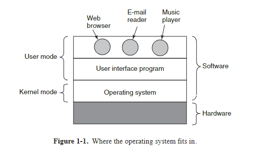
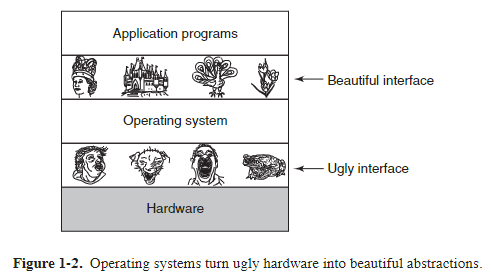
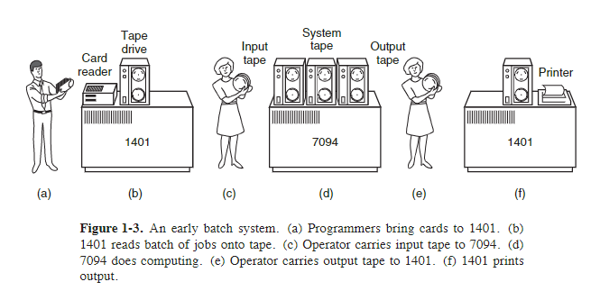
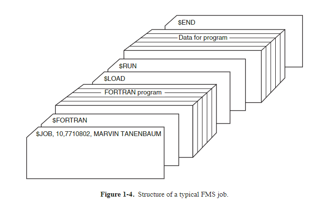
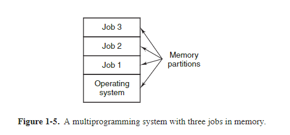

**Sinkronkan buku PDF Modern Operating System bertahap 1-4. Pertama 1.1 - 1.4, kedua 5 - 8, ketiga 9 - 12.**

<h1 align="center">1</h1>

><h1 align="center">INTRODUCTION</h1>

A modern  computer  consists  of  one  or  more  processors,  some  main  memory, disks,  printers,  a  keyboard,  a  mouse,  a  display, network  interfaces,  and  various other input/output devices. All in all, a complex system. If every application programmer had to understand how all these things work in detail, no code would ever get written. Furthermore, managing all these components and using them optimally
is an exceedingly challenging job. For this reason, computers are equipped with a layer  of  software  called  the **operating  system**, whose  job  is  to  provide  user  programs with a better, simpler, cleaner, model of the computer and to handle managing  all  the  resources  just  mentioned.  Operating  systems  are  the  subject  of  this book.

Most readers will have had some experience with an operating system such as Windows, Linux, FreeBSD, or OS X, but appearances can be deceiving. The program that users interact with, usually called the **shell** when it is text based and the **GUI (Graphical  User  Interface)**—which  is  pronounced  ‘‘gooey’’—when  it  uses
icons,  is  actually  not  part  of  the  operating  system,  although  it  uses  the  operating system to get its work done.

A simple  overview of the  main  components  under  discussion  here  is  given in
Fig. 1-1. Here we see the hardware at the bottom. The hardware consists of chips, boards,  disks,  a  keyboard,  a  monitor, and  similar   hysical  objects. On  top  of  the hardware  is  the  software. Most computers  have  two  modes  of  operation:  kernel mode  and  user  mode.  The  operating  system,  the  most  fundamental  piece  of  software,  runs  in **kernel  mode** (also  called **supervisor  mode**). In this  mode  it  has complete access to all the hardware and can execute any instruction the machine is
capable of executing. The rest of the software runs in **user mode**, in which only a subset of the machine instructions is available.  In particular, those instructions that
affect control of the machine or do **I/O** )*Input*/Output" are forbidden to user-mode programs. We will  come  back  to  the  difference  between  kernel  mode  and  user
mode repeatedly throughout this book. It plays a crucial role in how operating systems work.

The user interface program, shell or GUI, is the lowest level of user-mode software,  and  allows  the  user  to  start  other  programs,  such  as  a  Web  browser, email reader, or music player. These programs, too, make heavy use of the operating system.

The  placement  of  the  operating  system  is  shown  in  Fig. 1-1. It runs  on  the bare hardware and provides the base for all the other software.

An  important  distinction  between  the  operating  system  and  normal  (usermode) software is that if a user does not like a particular email reader, he† is free to get a different one or write his own if he so chooses; he is not free to write his own clock  interrupt  handler, which  is  part  of  the  operating  system  and  is  protected  by hardware against attempts by users to modify it. 

This  distinction,  however,  is sometimes  blurred  in  embedded  systems  (which may not have kernel mode) or  interpreted systems (such as Java-based systems that
use interpretation, not hardware, to separate the components).

Also,  in  many systems  there  are  programs  that  run  in  user  mode  but  help  the operating  system  or  perform  privileged  functions.  For  example,  there  is  often  a
program that allows users to change their passwords.  It is not part of the operating system and does not run in kernel mode, but it clearly carries out a sensitive function and has to be protected in a special way. In some systems, this idea is carried to  an  extreme,  and  pieces  of  what  is traditionally  considered  to  be  the  operating system (such as the file system) run in user space. In such systems, it is difficult to draw a clear  boundary. Everything  running  in  kernel  mode  is  clearly  part  of  the operating system, but some programs running outside it are arguably also part of it,
or at least closely associated with it.

Operating  systems  differ  from  user  (i.e.,  application)  programs  in  ways  other than where they reside.  In particular, they are huge, complex, and long-lived.  The
source  code  of  the  heart  of  an  operating  system  like Linux  or  Windows  is  on  the order of fiv e million lines of code or more. To  conceive of what this means, think
of  printing  out  fiv e million  lines  in  book  form,  with  50  lines  per  page  and  1000 pages per volume (larger than this book). It would take 100 volumes to list an op-
erating  system  of  this  size—essentially  an  entire  bookcase.  Can  you  imagine  getting  a  job  maintaining  an  operating  system  and  on  the  first  day  having  your  boss bring  you  to  a  bookcase  with  the  code  and  say:  ‘‘Go  learn  that.’’  And  this  is  only for  the  part  that  runs  in  the  kernel. When essential  shared  libraries  are  included, Windows  is  well  over 70 million  lines  of  code  or  10  to  20  bookcases.  And  this
excludes  basic  application  software  (things  like Windows  Explorer, Windows Media Player, and so on).

It should be clear now why operating systems live  a  long time—they are very hard  to  write,  and  having  written  one,  the  owner  is  loath  to  throw it out  and  start
again. Instead, such systems evolve over long periods of time. Windows 95/98/Me was basically one operating system and Windows NT/2000/XP/Vista/Windows 7 is a different  one.  They look  similar  to  the  users  because  Microsoft  made  very  sure that the user interface of Windows 2000/XP/Vista/Windows 7 was quite similar to that of the system it was replacing, mostly Windows 98. Nevertheless, there were very  good  reasons  why Microsoft  got  rid  of  Windows  98.  We will  come  to  these when we study Windows in detail in Chap. 11.

Besides Windows, the other main example we will use throughout this book is UNIX and its variants and clones. It, too, has evolved over the years, with versions like System  V, polaris,  and  FreeBSD  being  derived from  the  original  system, whereas Linux is a fresh code base, although very closely modeled on UNIX and highly compatible with it. We  will use examples from UNIX throughout this book and look at Linux in detail in Chap. 10.

In  this  chapter  we  will  briefly  touch  on  a  number  of  key  aspects  of  operating systems, including what they are, their history, what kinds are around, some of the basic concepts, and their structure. We  will come back to many of these important topics in later chapters in more detail. 

&nbsp;

# 1.1 WHAT IS AN OPERATING SYSTEM?

It is hard  to  pin  down  what  an  operating  system  is  other  than  saying  it  is  the software  that  runs  in  kernel  mode—and  even that  is  not  always  true.  Part  of  the problem  is  that  operating  systems  perform  two   ssentially  unrelated  functions: providing  application  programmers  (and  application  programs,  naturally)  a  clean
abstract  set  of  resources  instead  of  the  messy hardware  ones  and  managing  these hardware resources. Depending on who is doing the talking, you might hear mostly
about one function or the other. Let us now look at both.

## 1.1.1  The Operating System as an Extended Machine
The architecture (instruction  set,  memory  organization,  I/O,  and  bus  structure) of most computers at the machine-language level is primitive and awkward to program,  especially  for  input/output. To  make this  point  more  concrete,  consider modern **SATA (Serial ATA)** hard disks used on most computers. A book (Anderson,  2007)  describing  an  early  version  of  the  interface  to  the  disk—what  a  pro-
grammer would have to know to use the disk—ran over 450 pages. Since then, the interface  has  been  revised  multiple  times  and  is  more  complicated  than  it  was  in 2007.  Clearly, no sane programmer would want to deal with this disk at the hardware level. Instead, a piece of software, called a **disk driver**, deals with the hardware  and  provides  an  interface  to  read  and  write  disk  blocks,  without  getting  into the details. Operating systems contain many drivers for controlling I/O devices.

But  even this  level is much  too  low for  most  applications.  For  this  reason,  all operating  systems  provide  yet  another  layer  of  abstraction  for  using  disks:  files. Using this abstraction, programs can create, write, and read files, without having to deal with the messy details of how the hardware actually works.

This abstraction is the key  to managing all this complexity. Good abstractions turn  a  nearly  impossible  task  into  two manageable  ones.  The  first  is  defining  and implementing the abstractions. The second is using these abstractions to solve the problem  at  hand.  One  abstraction  that  almost  every  computer  user  understands  is the  file,  as  mentioned  above. It is a useful  piece  of  information,  such  as  a  digital photo, saved email message, song, or Web page. It is much easier to deal with photos,  emails,  songs,  and  Web  pages  than  with  the  details  of  SATA  (or  other)  disks. The job of the operating system is to create good abstractions and then implement and manage the abstract objects thus created. In this book, we will talk a lot about abstractions.  They are one of the keys to understanding operating systems.

This point is so important that it is worth repeating in different words. With all due  respect  to  the  industrial  engineers  who  so  carefully  designed  the  Macintosh,
hardware  is  ugly. Real  processors,  memories,  disks,  and  other  devices  are  very complicated  and  present  difficult,  awkward,  idiosyncratic,  and  inconsistent  inter-
faces to the people who have to write software to use them. Sometimes this is due to  the  need  for  backward  compatibility  with  older  hardware. Other times  it  is  an
attempt  to  save  money.  Often,  however,  the  hardware  designers  do  not  realize  (or care) how much trouble they are causing for the software. One of the major tasks of  the  operating  system  is  to  hide  the  hardware  and  present  programs  (and  their programmers)  with  nice,  clean,  elegant,  consistent,  abstractions  to  work  with  in-
stead. Operating systems turn the ugly into the beautiful, as shown in Fig. 1-2.

It  should  be  noted  that  the  operating  system’s real  customers  are  the  application  programs  (via  the  application  programmers,  of  course). They are  the  ones
who  deal  directly  with  the  operating  system  and  its  abstractions. In  contrast,  end users  deal  with  the  abstractions  provided  by  the  user  interface,  either  a  com-
mand-line shell or a graphical interface. While the abstractions at the user interface may be similar to the ones provided by the operating system, this is not always the case. To make this  point  clearer, consider  the  normal  Windows  desktop  and  the
line-oriented command prompt. Both are programs running on the Windows operating  system  and  use  the  abstractions  Windows  provides,  but  they offer  very  different user interfaces. Similarly, a Linux user running Gnome or KDE sees a very
different  interface  than  a  Linux  user  working  directly  on  top  of  the  underlying  X Window System, but the underlying operating system abstractions are the same in
both cases.

In this book, we will study the abstractions provided to application programs in great detail, but say rather little about user interfaces. That is a large and important subject, but one only peripherally related to operating systems.

## 1.1.2  The Operating System as a Resource Manager
The concept of an operating system as primarily providing abstractions to application programs is a top-down view. An alternative, bottom-up, view holds that the operating system is there to manage all the pieces of a complex system. Modern computers consist of processors, memories, timers, disks, mice, network interfaces, printers, and a wide variety of other devices.  In the bottom-up view,  the job of the operating system is to provide for an orderly and controlled allocation of the processors, memories, and I/O devices among the various programs wanting them.

Modern  operating  systems  allow multiple  programs  to  be  in  memory  and  run at the same time. Imagine what would happen if three programs running on some computer all tried to print their output simultaneously on the same printer. The first few lines of printout might be from program 1, the next few from program 2, then
some from program 3, and so forth. The result would be utter chaos. The operating system  can  bring  order  to  the potential  chaos  by  buffering  all  the  output  destined for the printer on the disk. When one program is finished, the operating system can then  copy its  output  from  the  disk  file  where  it  has  been  stored  for  the  printer, while  at  the  same  time  the  other  program  can  continue  generating  more  output, oblivious to the fact that the output is not really going to the printer (yet).

When a computer (or network) has more than one user, the need for managing and protecting the memory, I/O devices, and other resources is even more since the users  might  otherwise  interfere  with  one  another. In addition,  users  often  need  to share  not  only  hardware,  but  information  (files,  databases,  etc.)  as  well. In  short, this  view of the  operating  system  holds  that  its  primary  task  is  to  keep  track  of which  programs  are  using  which  resource,  to  grant  resource  requests,  to  account for usage, and to mediate 
conflicting requests from different programs and users. 

Resource  management  includes **multiplexing** (sharing)  resources  in  two different  ways:  in  time  and  in  space.  When  a  resource  is  time  multiplexed,  different programs  or  users  take turns  using  it.  First  one  of  them  gets  to  use  the  resource, then another, and so on. For example, with only one CPU and multiple programs that want to run on it, the operating system first allocates the CPU to one program,
then, after it has run long enough, another program gets to use the CPU, then another, and then eventually the first one again. Determining how the resource is time multiplexed—who  goes  next  and  for  how long—is  the  task  of  the  operating  system.  Another  example  of  time  multiplexing  is  sharing  the  printer. When  multiple print jobs are queued up for printing on a single printer, a decision has to be made about which one is to be printed next.

The other kind of multiplexing is space multiplexing. Instead of the customers taking turns, each one gets part of the resource. For example, main memory is normally divided up among several running programs, so each one can be resident at the same time (for example, in order to take turns using the CPU). Assuming there is  enough  memory  to  hold  multiple  programs,  it  is  more  efficient  to  hold  several programs in memory at once rather than give  one of them all of it, especially if it only  needs  a  small  fraction  of  the  total. Of  course,  this  raises  issues  of  fairness, protection, and so on, and it is up to the operating system to solve them. Another resource  that  is  space  multiplexed is the  disk. In  many systems  a  single  disk  can hold  files  from  many users  at  the  same  time.  Allocating  disk  space  and  keeping track of who is using which disk blocks is a typical operating system task.

# 1.2  HISTORY OF OPERATING SYSTEMS

Operating systems have been evolving through the years. In the following sections we will briefly look at a few of the highlights. Since operating systems have historically  been  closely  tied  to  the  architecture  of  the  computers  on  which  they run, we will look at successive  generations of computers to see what their operating systems were like. This mapping of operating system generations to computer generations  is  crude,  but  it  does  provide  some  structure  where  there  would  otherwise be none.

The progression given below is largely chronological, but it has been a bumpy ride.  Each  development  did  not  wait  until  the  previous  one  nicely  finished  before getting  started.  There  was  a  lot  of  overlap,  not  to  mention  many false  starts  and dead ends. Take this as a guide, not as the last word.

The  first  true  digital  computer  was  designed  by  the  English  mathematician Charles Babbage (1792–1871). Although Babbage spent most of his life and fortune  trying  to  build  his  ‘‘analytical  engine,’’  he nev er got  it  working  properly  because  it  was  purely  mechanical,  and  the  technology  of  his  day  could  not  produce the required wheels, gears, and cogs to the high precision that he needed. Needless to say, the analytical engine did not have an operating system.

As  an  interesting  historical  aside,  Babbage  realized  that  he  would  need  software  for  his  analytical  engine,  so  he  hired  a  young  woman  named  Ada  Lovelace, who  was  the  daughter  of  the  famed  British  poet  Lord  Byron,  as  the  world’s first programmer. The programming language Ada® is named after her.

## 1.2.1  The First Generation (1945–55): Vacuum Tubes

After Babbage’s unsuccessful efforts, little progress was made in constructing digital computers until the World War II period, which stimulated an explosion of activity. Professor  John  Atanasoff and  his  graduate  student  Clifford  Berry  built
what is now reg arded as the first functioning digital computer at Iowa State University. It used 300 vacuum tubes. At roughly the same time, Konrad Zuse in Berlin built the Z3 computer out of electromechanical relays. In 1944, the Colossus was built and programmed by a group of scientists (including Alan Turing) at Bletchley Park, England, the Mark I was built by Howard Aiken at Harvard, and the ENIAC was built  by  William  Mauchley and  his  graduate  student  J.  Presper  Eckert  at  the University  of  Pennsylvania.  Some  were  binary, some  used  vacuum  tubes,  some were programmable, but all were very primitive and took seconds to perform even the simplest calculation.

In  these  early  days,  a  single  group  of  people  (usually  engineers)  designed, built, programmed, operated, and maintained each machine. All programming was done in absolute machine language, or even worse yet, by wiring up electrical circuits  by  connecting  thousands  of  cables  to  plugboards  to  control  the  machine’s basic  functions.  Programming   languages  were  unknown  (even assembly  language was unknown).  Operating systems were unheard of. The usual mode of operation
was for the programmer to sign up for a block of time using the signup sheet on the wall,  then  come  down  to  the  machine  room,  insert  his  or  her  plugboard  into  the computer, and spend the next few hours hoping that none of the 20,000 or so vacuum  tubes  would  burn  out  during  the  run.  Virtually  all  the  problems  were  simple straightforward  mathematical  and  numerical  calculations,  such  as  grinding  out tables of sines, cosines, and logarithms, or computing artillery trajectories.

By the early 1950s, the routine had improved somewhat with the introduction of punched cards. It was now possible to write programs on cards and read them in instead of using plugboards; otherwise, the procedure was the same.

## 1.2.2 The Second Generation (1955–65): Transistors and Batch Systems

The  introduction  of  the  transistor  in  the  mid-1950s  changed  the  picture  radically. Computers became reliable enough that they could be manufactured and sold to paying customers with the expectation that they would continue to function long enough to get some useful work done. For the first time, there was a clear separation  between  designers,  builders,  operators,  programmers,  and  maintenance  per-
sonnel. 

These machines, now called **mainframes**, were locked away in large, specially air-conditioned computer rooms, with staffs of professional operators to run them. Only large corporations or major government agencies or universities could afford the multimillion-dollar price tag. To  run a **job** (i.e., a program or set of programs),a programmer  would  first  write  the  program  on  paper  (in  FORTRAN  or  assembler), then punch it on cards. He would then bring the card deck down to the input room and hand it to one of the operators and go drink coffee until the output was ready.

When the computer finished whatever job it was currently running, an operator would go over to the printer and tear off the output and carry it over to the output room, so that the programmer could collect it later. Then he would take one of the card decks that had been brought from the input room and read it in. If the FOR TRAN compiler was needed, the operator would have  to get it from a file cabinet and  read  it  in.  Much  computer  time  was  wasted  while  operators  were  walking
around the machine room.

Given the  high  cost  of  the  equipment,  it  is  not  surprising  that  people  quickly looked for ways to reduce the wasted time. The solution generally adopted was the batch  system. The  idea  behind  it  was  to  collect  a  tray  full  of  jobs  in  the  input room and then read them onto a magnetic tape using a small (relatively) inexpensive  computer, such  as  the  IBM  1401,  which  was  quite  good  at  reading  cards,
copying  tapes,  and  printing  output,  but  not  at  all  good  at  numerical  calculations. Other, much  more  expensive  machines,  such  as  the  IBM  7094,  were  used  for  the real computing. This situation is shown in Fig. 1-3.

After  about  an  hour  of  collecting  a  batch  of  jobs,  the  cards  were  read  onto  a magnetic tape, which was carried into the machine room, where it was mounted on a tape  drive. The  operator  then  loaded  a  special  program  (the  ancestor  of  today’s operating  system),  which  read  the  first  job  from  tape  and  ran  it.  The  output  was written  onto  a  second  tape,  instead  of  being  printed. After  each  job  finished,  the operating system automatically read the next job from the tape and began running

it.  When  the  whole  batch  was  done,  the  operator  removed the  input  and  output tapes, replaced the input tape with the next batch, and brought the output tape to a 1401 for printing **off line** (i.e., not connected to the main computer).

The  structure  of  a  typical  input  job  is  shown  in  Fig. 1-4. It started  out  with  a $JOB card, specifying the maximum run time in minutes, the account number to be charged,  and  the  programmer’s name.  Then  came  a  $FORTRAN  card,  telling  the operating system to load the FORTRAN compiler from the system tape. It was directly followed by the program to be compiled, and then a $LOAD card, directing the  operating  system  to  load  the  object  program  just  compiled. (Compiled  programs  were  often  written  on  scratch  tapes  and  had  to  be  loaded  explicitly.) Next came the $RUN card, telling the operating system to run the program with the data following  it.  Finally, the  $END  card  marked  the  end  of  the  job. These  primitive control  cards  were  the  forerunners  of  modern  shells  and  command-line  interpreters.

Large second-generation computers were used mostly for scientific and engineering calculations, such as solving the partial differential equations that often occur in physics and engineering. They were largely programmed in FORTRAN and
assembly  language. Typical  operating  systems  were  FMS  (the  Fortran  Monitor System) and IBSYS, IBM’s operating system for the 7094.

## 1.2.3  The Third Generation (1965–1980): ICs and Multiprogramming

By the early 1960s, most computer manufacturers had two distinct, incompatible, product lines. On the one hand, there were the word-oriented, large-scale scientific  computers,  such  as  the  7094,  which  were  used  for  industrial-strength  numerical calculations in science and engineering. On the other hand, there were the

character-oriented,  commercial  computers,  such  as  the  1401,  which  were  widely used for tape sorting and printing by banks and insurance companies.

Developing and maintaining two completely different product lines was an expensive  proposition  for  the  manufacturers. In addition,  many new  computer  customers  initially  needed  a  small  machine  but  later  outgrew it and  wanted  a  bigger machine that would run all their old programs, but faster.

IBM attempted to solve both of these problems at a single stroke by introducing the System/360. The 360 was a series of software-compatible machines ranging  from  1401-sized  models  to  much  larger  ones,  more  powerful  than  the  mighty 7094. The machines  differed  only  in  price  and  performance  (maximum  memory, processor speed, number of I/O devices permitted, and so forth). Since they all had the same architecture and instruction set, programs written for one machine could run  on  all  the  others—at  least  in  theory. (But  as  Yogi  Berra  reputedly  said:  ‘‘In theory, theory and practice are the same; in practice, they are not.’’) Since the 360 was designed to handle both scientific (i.e., numerical) and commercial computing, a single family of machines could satisfy the needs of all customers. In subsequent years,  IBM  came  out  with  backward  compatible  successors  to  the  360  line,  using more modern technology, known as the 370, 4300, 3080, and 3090. The zSeries is the most recent descendant of this line, although it has diverged considerably from the original.

The IBM 360 was the first major computer line to use (small-scale) **ICs (Integrated  Circuits)**,  thus  providing  a  major  price/performance  advantage  over the second-generation  machines,  which  were  built  up  from  individual  transistors. It was an immediate success, and the idea of a family of compatible computers was soon  adopted  by  all  the  other  major  manufacturers.  The  descendants  of  these  machines are still in use at computer centers today. Now adays they are often used for managing  huge  databases  (e.g.,  for  airline  reservation  systems)  or  as  servers  for World Wide Web sites that must process thousands of requests per second.

The greatest strength of the ‘‘single-family’’ idea was simultaneously its greatest weakness. The original intention was that all software, including the operating system, **OS/360**, had to work on all models. It had to run on small systems, which often  just  replaced  1401s  for  copying  cards  to  tape,  and  on  very  large  systems, which often replaced 7094s for doing weather forecasting and other heavy computing.  It had to be good on systems with few peripherals and on systems with many peripherals.  It had to work in commercial environments and in scientific environments.  Above all, it had to be efficient for all of these different uses.

There  was  no  way  that  IBM  (or  anybody  else  for  that  matter)  could  write  a
piece  of  software  to  meet  all  those  conflicting  requirements.  The  result  was  an
enormous  and  extraordinarily  complex operating  system,  probably  two to three
orders of magnitude larger than FMS. It consisted of millions of lines of assembly
language  written  by  thousands  of  programmers,  and  contained  thousands  upon
thousands  of  bugs,  which  necessitated  a  continuous  stream  of  new releases  in  an
attempt  to  correct  them.  Each  new release  fixed  some  bugs  and  introduced  new
ones, so the number of bugs probably remained constant over time.

One of the designers of OS/360, Fred Brooks, subsequently wrote a witty and
incisive  book  (Brooks,  1995)  describing  his  experiences  with  OS/360. While  it
would  be  impossible  to  summarize  the  book  here,  suffice  it  to  say  that  the  cover
shows a herd of prehistoric beasts stuck in a tar pit. The cover of Silberschatz et al.
(2012) makes a similar point about operating systems being dinosaurs.

Despite its enormous size and problems, OS/360 and the similar third-genera-
tion  operating  systems  produced  by  other  computer  manufacturers  actually  satisfied  most  of  their  customers  reasonably  well.  They also  popularized  several  key
techniques  absent  in  second-generation  operating  systems.  Probably  the  most  im-
portant  of  these  was **multiprogramming**. On the  7094,  when  the  current  job
paused  to  wait  for  a  tape  or  other  I/O  operation  to  complete,  the  CPU  simply  sat
idle  until  the  I/O  finished.  With  heavily  CPU-bound  scientific  calculations,  I/O  is
infrequent, so this wasted time is not significant. With commercial data processing,
the I/O wait time can often be 80 or 90% of the total time, so something had to be
done to avoid having the (expensive) CPU be idle so much.

The  solution  that  evolved  was  to  partition  memory  into  several  pieces,  with  a
different job in each partition, as shown in Fig. 1-5.  While one job was waiting for
I/O to complete, another job could be using the CPU. If enough jobs could be held
in  main  memory  at  once,  the  CPU  could  be  kept  busy  nearly  100%  of  the  time.
Having multiple jobs safely in memory at once requires special hardware to protect
each  job  against  snooping  and  mischief  by  the  other  ones,  but  the  360  and  other
third-generation systems were equipped with this hardware.

Another  major  feature  present  in  third-generation  operating  systems  was  the
ability  to  read  jobs  from  cards  onto  the  disk  as  soon  as  they were  brought  to  the
computer room. Then, whenever a running job finished, the operating system could
load a new job from the disk into the now-empty partition and run it. This techni-
que  is  called **spooling** (from **Simultaneous  Peripheral  Operation  On  Line**) and 
was also  used  for  output.  With  spooling,  the  1401s  were  no  longer  needed,  and
much carrying of tapes disappeared.

Although third-generation operating systems were well suited for big scientific
calculations and massive commercial data-processing runs, they were still basically
batch  systems.  Many programmers  pined  for  the  first-generation  days  when  they
had the machine all to themselves for a few hours, so they could debug their programs  quickly. With  third-generation  systems,  the  time  between  submitting  a  job
and getting back the output was often several hours, so a single misplaced comma
could  cause  a  compilation  to  fail,  and  the  programmer  to  waste  half  a  day. Pro-
grammers did not like that very much.

This  desire  for  quick  response  time  paved the  way  for **timesharing**, a variant
of multiprogramming, in which each user has an online terminal. In a timesharing
system, if 20 users are logged in and 17 of them are thinking or talking or drinking
coffee, the CPU can be allocated in turn to the three jobs that want service. Since
people  debugging  programs  usually  issue  short  commands  (e.g.,  compile  a  five page  procedure†)  rather  than  long  ones  (e.g.,  sort  a  million-record  file),  the  com-
puter  can  provide  fast,  interactive  service  to  a  number  of  users  and  perhaps  also
work  on  big  batch  jobs  in  the  background  when  the  CPU  is  otherwise  idle.  The
first general-purpose timesharing system, **CTSS** (**Compatible Time Sharing System**), was developed at M.I.T. on a specially modified 7094 (Corbato ́ et al., 1962).
However,  timesharing did not really become popular until the necessary protection
hardware became widespread during the third generation.

After the success of the CTSS system, M.I.T., Bell Labs, and General Electric
(at  that  time  a  major  computer  manufacturer)  decided  to  embark  on  the  develop-
ment of a ‘‘computer utility,’’ that is, a machine that would support some hundreds of simultaneous timesharing users. Their model was the electricity system—when
you  need  electric  power, you  just  stick  a  plug  in  the  wall,  and  within  reason,  as
much  power  as  you  need  will  be  there.  The  designers  of  this  system,  known  as
**MULTICS** (**MULTiplexed  Information  and  Computing  Service**),  envisioned
one  huge  machine  providing  computing  power  for  everyone  in  the  Boston  area.
The idea that machines 10,000 times faster than their GE-645 mainframe would be
sold  (for  well  under  $1000)  by  the  millions  only  40  years  later  was  pure  science
fiction. Sort of like the idea of supersonic trans-Atlantic undersea trains now.

MULTICS was a mixed success. It was designed to support hundreds of users
on a machine only slightly more powerful than an Intel 386-based PC, although it
had much more I/O capacity. This is not quite as crazy as it sounds, since in those
days  people  knew how  to write  small,  efficient  programs,  a  skill  that  has  subsequently  been  completely  lost.  There  were  many reasons  that  MULTICS  did  not
take over the  world,  not  the  least  of  which  is  that  it  was  written  in  the  PL/I  pro-
gramming language, and the PL/I compiler was years late and barely worked at all
when  it  finally  arrived. In addition,  MULTICS  was  enormously  ambitious  for  its
time, much like Charles Babbage’s analytical engine in the nineteenth century.

To  make a long story short, MULTICS introduced many seminal ideas into the
computer  literature,  but  turning  it  into  a  serious  product  and  a  major  commercial
success  was  a  lot  harder  than  anyone  had  expected.  Bell  Labs  dropped  out  of  the
project,  and  General  Electric  quit  the  computer  business  altogether. Howev er,
M.I.T. persisted and eventually got MULTICS working.  It was ultimately sold as a
commercial product by the company (Honeywell) that bought GE’s computer busi-
ness  and  was  installed  by  about  80  major  companies  and  universities  worldwide.
While  their  numbers  were  small,  MULTICS  users  were  fiercely  loyal. General
Motors, Ford, and the U.S. National Security Agency,  for example, shut down their
MULTICS systems only in the late 1990s, 30 years after MULTICS was released,
after years of trying to get Honeywell to update the hardware.

By  the  end  of  the  20th  century, the  concept  of  a  computer  utility  had  fizzled
out,  but  it  may  well  come  back  in  the  form  of cloud  computing, in which  relatively  small  computers  (including  smartphones,  tablets,  and  the  like)  are  con-
nected to servers in vast and distant data centers where all the computing is done,
with  the  local  computer  just  handling  the  user  interface. The motivation  here  is
that most people do not want to administrate an increasingly complex and finicky
computer system and would prefer to have that work done by a team of profession-
als, for example, people working for the company running the data center. E-commerce is already evolving in this direction, with various companies running emails
on  multiprocessor  servers  to  which  simple  client  machines  connect,  very  much  in
the spirit of the MULTICS design.

Despite  its  lack  of  commercial  success,  MULTICS  had  a  huge  influence  on
subsequent  operating  systems  (especially  UNIX  and  its  derivatives,  FreeBSD,
Linux, iOS, and Android). It is described in several papers and a book (Corbato ́ et 
al., 1972; Corbato ́ and Vyssotsky,  1965; Daley and Dennis, 1968; Organick, 1972;

##### †We will use the terms ‘‘procedure,’’  ‘‘subroutine,’’  and ‘‘function’’ interchangeably in this book.

and  Saltzer, 1974). It also  has  an  active  Website,  located  at www.multicians.org,
with much information about the system, its designers, and its users.

Another  major  development  during  the  third  generation  was  the  phenomenal
growth of minicomputers, starting with the DEC PDP-1 in 1961. The PDP-1 had
only 4K of 18-bit words, but at $120,000 per machine (less than 5% of the price of
a 7094),  it  sold  like hotcakes.  For  certain  kinds  of  nonnumerical  work,  it  was  al-
most as fast as the 7094 and gav e birth to a whole new industry. It was quickly followed by a series of other PDPs (unlike IBM’s family, all incompatible) culminat-
ing in the PDP-11.

One of the computer scientists at Bell Labs who had worked on the MULTICS
project, Ken Thompson, subsequently found a small PDP-7 minicomputer that no
one was using and set out to write a stripped-down, one-user version of MULTICS.
This work later developed into the **UNIX** operating system, which became popular
in the academic world, with government agencies, and with many companies.

The history of UNIX has been told elsewhere (e.g., Salus, 1994). Part of that
story will be given in Chap. 10. For now, suffice it to say that because the source
code was widely available, various organizations developed their own (incompatible) versions, which led to chaos. Two major versions developed, System V, from
AT&T, and **BSD** (**Berkeley  Software Distribution**) from  the  University  of  California at Berkeley.  These had minor variants as well. To  make it possible to write
programs  that  could  run  on  any UNIX  system,  IEEE  developed  a  standard  for
UNIX, called **POSIX**, that most versions of UNIX now support.  POSIX defines a
minimal  system-call  interface  that  conformant  UNIX  systems  must  support. In
fact, some other operating systems now also support the POSIX interface.

As  an  aside,  it  is  worth  mentioning  that  in  1987,  the  author  released  a  small
clone  of  UNIX,  called **MINIX**, for  educational  purposes.  Functionally, MINIX  is
very similar to UNIX, including POSIX support. Since that time, the original version has evolved into MINIX 3, which is highly modular and focused on very high
reliability. It has  the  ability  to  detect  and  replace  faulty  or  even crashed  modules
(such as I/O device drivers) on the fly without a reboot and without disturbing running programs. Its focus is on providing very high dependability and availability.
A book describing its internal operation and listing the source code in an appendix
is also available (Tanenbaum and Woodhull, 2006). The MINIX 3 system is available for free (including all the source code) over the Internet at www.minix3.org.

The desire for a free production (as opposed to educational) version of MINIX
led  a  Finnish  student,  Linus  Torvalds,  to  write **Linux**. This  system  was  directly
inspired by and developed on MINIX and originally supported various MINIX features  (e.g.,  the  MINIX  file  system). It  has  since  been  extended  in  many ways  by
many people but still retains some underlying structure common to MINIX and to
UNIX. Readers interested  in  a  detailed  history  of  Linux  and  the  open  source
movement  might  want  to  read  Glyn  Moody’s (2001)  book.  Most  of  what  will  be
said about UNIX in this book thus applies to System V, MINIX, Linux, and other
versions and clones of UNIX as well.

## 1.2.4 The Fourth Generation (1980-Present): Personal Computers

With the development of **LSI** (**Large Scale Integration**) circuits—chips containing  thousands  of  transistors  on  a  square  centimeter  of  silicon—the  age  of  the
personal computer dawned.  In terms of architecture, personal computers (initially
called microcomputers) were  not  all  that  different  from  minicomputers  of  the
PDP-11  class,  but  in  terms  of  price  they certainly  were  different.  Where  the
minicomputer made it possible for a department in a company or university to have
its own computer, the microprocessor chip made it possible for a single individual
to have his or her own personal computer.

In  1974,  when  Intel  came  out  with  the  8080,  the  first  general-purpose  8-bit
CPU, it wanted an operating system for the 8080, in part to be able to test it. Intel
asked  one  of  its  consultants,  Gary  Kildall,  to  write  one. Kildall  and  a  friend  first
built a controller for the newly released Shugart Associates 8-inch floppy disk and
hooked the floppy disk up to the 8080, thus producing the first microcomputer with
a disk.  Kildall  then  wrote  a  disk-based  operating  system  called **CP/M** (**Control
Program  for  Microcomputers**) for  it.  Since  Intel  did  not  think  that  disk-based
microcomputers had much of a future, when Kildall asked for the rights to CP/M,
Intel granted his request. Kildall then formed a company,  Digital Research, to further develop and sell CP/M.

In 1977, Digital Research rewrote CP/M to make it suitable for running on the
many microcomputers using the 8080, Zilog Z80, and other CPU chips. Many application  programs  were  written  to  run  on  CP/M,  allowing  it  to  completely  domi-
nate the world of microcomputing for about 5 years.

In the early 1980s, IBM designed the IBM PC and looked around for software
to  run  on  it.  People  from  IBM  contacted  Bill  Gates  to  license  his  BASIC  interpreter. They also  asked  him  if  he  knew of an operating  system  to  run  on  the  PC.
Gates suggested that IBM contact Digital Research, then the world’s dominant operating  systems  company.  Making  what  was  surely  the  worst  business  decision  in
recorded history, Kildall refused to meet with IBM, sending a subordinate instead.
To  make matters even worse, his lawyer even refused to sign IBM’s nondisclosure
agreement  covering  the  not-yet-announced  PC. Consequently, IBM  went  back  to
Gates asking if he could provide them with an operating system.

When  IBM  came  back,  Gates  realized  that  a  local  computer  manufacturer,
Seattle  Computer  Products,  had  a  suitable  operating  system, **DOS** (**Disk  Operat-
ing  System**). He approached  them  and  asked  to  buy  it  (allegedly  for  $75,000),
which  they readily  accepted.  Gates  then  offered  IBM  a  DOS/BASIC  package,
which  IBM  accepted. IBM  wanted  certain  modifications,  so  Gates  hired  the  per-
son who wrote DOS, Tim Paterson, as an employee of Gates’ fledgling company,
Microsoft,  to  make them.  The  revised  system  was  renamed **MS-DOS** (**MicroSoft
Disk  Operating  System**) and  quickly  came  to  dominate  the  IBM  PC  market. A
key factor here was Gates’ (in retrospect, extremely wise) decision to sell MS-DOS
to  computer  companies  for  bundling  with  their  hardware,  compared  to  

