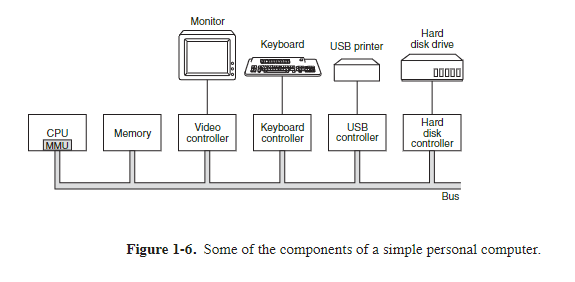
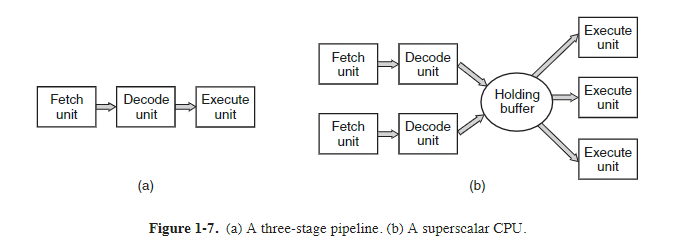
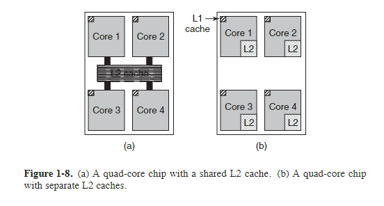
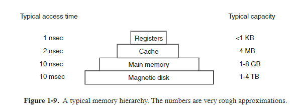

**Sinkronkan buku PDF Modern Operating System bertahap 1-4. Pertama 1.1 - 1.4, kedua 5 - 8, ketiga 9 - 12.**

<h1 align="center">1</h1>

><h1 align="center">INTRODUCTION</h1>

A modern  computer  consists  of  one  or  more  processors,  some  main  memory, disks,  printers,  a  keyboard,  a  mouse,  a  display, network  interfaces,  and  various other input/output devices. All in all, a complex system. If every application programmer had to understand how all these things work in detail, no code would ever get written. Furthermore, managing all these components and using them optimally
is an exceedingly challenging job. For this reason, computers are equipped with a layer  of  software  called  the **operating  system**, whose  job  is  to  provide  user  programs with a better, simpler, cleaner, model of the computer and to handle managing  all  the  resources  just  mentioned.  Operating  systems  are  the  subject  of  this book.

Most readers will have had some experience with an operating system such as Windows, Linux, FreeBSD, or OS X, but appearances can be deceiving. The program that users interact with, usually called the **shell** when it is text based and the **GUI (Graphical  User  Interface)**—which  is  pronounced  ‘‘gooey’’—when  it  uses
icons,  is  actually  not  part  of  the  operating  system,  although  it  uses  the  operating system to get its work done.

A simple  overview of the  main  components  under  discussion  here  is  given in
Fig. 1-1. Here we see the hardware at the bottom. The hardware consists of chips, boards,  disks,  a  keyboard,  a  monitor, and  similar   hysical  objects. On  top  of  the hardware  is  the  software. Most computers  have  two  modes  of  operation:  kernel mode  and  user  mode.  The  operating  system,  the  most  fundamental  piece  of  software,  runs  in **kernel  mode** (also  called **supervisor  mode**). In this  mode  it  has complete access to all the hardware and can execute any instruction the machine is
capable of executing. The rest of the software runs in **user mode**, in which only a subset of the machine instructions is available.  In particular, those instructions that
affect control of the machine or do **I/O** )*Input*/Output" are forbidden to user-mode programs. We will  come  back  to  the  difference  between  kernel  mode  and  user
mode repeatedly throughout this book. It plays a crucial role in how operating systems work.

The user interface program, shell or GUI, is the lowest level of user-mode software,  and  allows  the  user  to  start  other  programs,  such  as  a  Web  browser, email reader, or music player. These programs, too, make heavy use of the operating system.

The  placement  of  the  operating  system  is  shown  in  Fig. 1-1. It runs  on  the bare hardware and provides the base for all the other software.

An  important  distinction  between  the  operating  system  and  normal  (usermode) software is that if a user does not like a particular email reader, he† is free to get a different one or write his own if he so chooses; he is not free to write his own clock  interrupt  handler, which  is  part  of  the  operating  system  and  is  protected  by hardware against attempts by users to modify it. 

This  distinction,  however,  is sometimes  blurred  in  embedded  systems  (which may not have kernel mode) or  interpreted systems (such as Java-based systems that
use interpretation, not hardware, to separate the components).

Also,  in  many systems  there  are  programs  that  run  in  user  mode  but  help  the operating  system  or  perform  privileged  functions.  For  example,  there  is  often  a
program that allows users to change their passwords.  It is not part of the operating system and does not run in kernel mode, but it clearly carries out a sensitive function and has to be protected in a special way. In some systems, this idea is carried to  an  extreme,  and  pieces  of  what  is traditionally  considered  to  be  the  operating system (such as the file system) run in user space. In such systems, it is difficult to draw a clear  boundary. Everything  running  in  kernel  mode  is  clearly  part  of  the operating system, but some programs running outside it are arguably also part of it,
or at least closely associated with it.

Operating  systems  differ  from  user  (i.e.,  application)  programs  in  ways  other than where they reside.  In particular, they are huge, complex, and long-lived.  The
source  code  of  the  heart  of  an  operating  system  like Linux  or  Windows  is  on  the order of fiv e million lines of code or more. To  conceive of what this means, think
of  printing  out  fiv e million  lines  in  book  form,  with  50  lines  per  page  and  1000 pages per volume (larger than this book). It would take 100 volumes to list an op-
erating  system  of  this  size—essentially  an  entire  bookcase.  Can  you  imagine  getting  a  job  maintaining  an  operating  system  and  on  the  first  day  having  your  boss bring  you  to  a  bookcase  with  the  code  and  say:  ‘‘Go  learn  that.’’  And  this  is  only for  the  part  that  runs  in  the  kernel. When essential  shared  libraries  are  included, Windows  is  well  over 70 million  lines  of  code  or  10  to  20  bookcases.  And  this
excludes  basic  application  software  (things  like Windows  Explorer, Windows Media Player, and so on).

It should be clear now why operating systems live  a  long time—they are very hard  to  write,  and  having  written  one,  the  owner  is  loath  to  throw it out  and  start
again. Instead, such systems evolve over long periods of time. Windows 95/98/Me was basically one operating system and Windows NT/2000/XP/Vista/Windows 7 is a different  one.  They look  similar  to  the  users  because  Microsoft  made  very  sure that the user interface of Windows 2000/XP/Vista/Windows 7 was quite similar to that of the system it was replacing, mostly Windows 98. Nevertheless, there were very  good  reasons  why Microsoft  got  rid  of  Windows  98.  We will  come  to  these when we study Windows in detail in Chap. 11.

Besides Windows, the other main example we will use throughout this book is UNIX and its variants and clones. It, too, has evolved over the years, with versions like System  V, polaris,  and  FreeBSD  being  derived from  the  original  system, whereas Linux is a fresh code base, although very closely modeled on UNIX and highly compatible with it. We  will use examples from UNIX throughout this book and look at Linux in detail in Chap. 10.

In  this  chapter  we  will  briefly  touch  on  a  number  of  key  aspects  of  operating systems, including what they are, their history, what kinds are around, some of the basic concepts, and their structure. We  will come back to many of these important topics in later chapters in more detail. 

&nbsp;

# 1.1 WHAT IS AN OPERATING SYSTEM?

It is hard  to  pin  down  what  an  operating  system  is  other  than  saying  it  is  the software  that  runs  in  kernel  mode—and  even that  is  not  always  true.  Part  of  the problem  is  that  operating  systems  perform  two   ssentially  unrelated  functions: providing  application  programmers  (and  application  programs,  naturally)  a  clean
abstract  set  of  resources  instead  of  the  messy hardware  ones  and  managing  these hardware resources. Depending on who is doing the talking, you might hear mostly
about one function or the other. Let us now look at both.

## 1.1.1  The Operating System as an Extended Machine
The architecture (instruction  set,  memory  organization,  I/O,  and  bus  structure) of most computers at the machine-language level is primitive and awkward to program,  especially  for  input/output. To  make this  point  more  concrete,  consider modern **SATA (Serial ATA)** hard disks used on most computers. A book (Anderson,  2007)  describing  an  early  version  of  the  interface  to  the  disk—what  a  pro-
grammer would have to know to use the disk—ran over 450 pages. Since then, the interface  has  been  revised  multiple  times  and  is  more  complicated  than  it  was  in 2007.  Clearly, no sane programmer would want to deal with this disk at the hardware level. Instead, a piece of software, called a **disk driver**, deals with the hardware  and  provides  an  interface  to  read  and  write  disk  blocks,  without  getting  into the details. Operating systems contain many drivers for controlling I/O devices.

But  even this  level is much  too  low for  most  applications.  For  this  reason,  all operating  systems  provide  yet  another  layer  of  abstraction  for  using  disks:  files. Using this abstraction, programs can create, write, and read files, without having to deal with the messy details of how the hardware actually works.

This abstraction is the key  to managing all this complexity. Good abstractions turn  a  nearly  impossible  task  into  two manageable  ones.  The  first  is  defining  and implementing the abstractions. The second is using these abstractions to solve the problem  at  hand.  One  abstraction  that  almost  every  computer  user  understands  is the  file,  as  mentioned  above. It is a useful  piece  of  information,  such  as  a  digital photo, saved email message, song, or Web page. It is much easier to deal with photos,  emails,  songs,  and  Web  pages  than  with  the  details  of  SATA  (or  other)  disks. The job of the operating system is to create good abstractions and then implement and manage the abstract objects thus created. In this book, we will talk a lot about abstractions.  They are one of the keys to understanding operating systems.

This point is so important that it is worth repeating in different words. With all due  respect  to  the  industrial  engineers  who  so  carefully  designed  the  Macintosh,
hardware  is  ugly. Real  processors,  memories,  disks,  and  other  devices  are  very complicated  and  present  difficult,  awkward,  idiosyncratic,  and  inconsistent  inter-
faces to the people who have to write software to use them. Sometimes this is due to  the  need  for  backward  compatibility  with  older  hardware. Other times  it  is  an
attempt  to  save  money.  Often,  however,  the  hardware  designers  do  not  realize  (or care) how much trouble they are causing for the software. One of the major tasks of  the  operating  system  is  to  hide  the  hardware  and  present  programs  (and  their programmers)  with  nice,  clean,  elegant,  consistent,  abstractions  to  work  with  in-
stead. Operating systems turn the ugly into the beautiful, as shown in Fig. 1-2.

It  should  be  noted  that  the  operating  system’s real  customers  are  the  application  programs  (via  the  application  programmers,  of  course). They are  the  ones
who  deal  directly  with  the  operating  system  and  its  abstractions. In  contrast,  end users  deal  with  the  abstractions  provided  by  the  user  interface,  either  a  com-
mand-line shell or a graphical interface. While the abstractions at the user interface may be similar to the ones provided by the operating system, this is not always the case. To make this  point  clearer, consider  the  normal  Windows  desktop  and  the
line-oriented command prompt. Both are programs running on the Windows operating  system  and  use  the  abstractions  Windows  provides,  but  they offer  very  different user interfaces. Similarly, a Linux user running Gnome or KDE sees a very
different  interface  than  a  Linux  user  working  directly  on  top  of  the  underlying  X Window System, but the underlying operating system abstractions are the same in
both cases.

In this book, we will study the abstractions provided to application programs in great detail, but say rather little about user interfaces. That is a large and important subject, but one only peripherally related to operating systems.

## 1.1.2  The Operating System as a Resource Manager
The concept of an operating system as primarily providing abstractions to application programs is a top-down view. An alternative, bottom-up, view holds that the operating system is there to manage all the pieces of a complex system. Modern computers consist of processors, memories, timers, disks, mice, network interfaces, printers, and a wide variety of other devices.  In the bottom-up view,  the job of the operating system is to provide for an orderly and controlled allocation of the processors, memories, and I/O devices among the various programs wanting them.

Modern  operating  systems  allow multiple  programs  to  be  in  memory  and  run at the same time. Imagine what would happen if three programs running on some computer all tried to print their output simultaneously on the same printer. The first few lines of printout might be from program 1, the next few from program 2, then
some from program 3, and so forth. The result would be utter chaos. The operating system  can  bring  order  to  the potential  chaos  by  buffering  all  the  output  destined for the printer on the disk. When one program is finished, the operating system can then  copy its  output  from  the  disk  file  where  it  has  been  stored  for  the  printer, while  at  the  same  time  the  other  program  can  continue  generating  more  output, oblivious to the fact that the output is not really going to the printer (yet).

When a computer (or network) has more than one user, the need for managing and protecting the memory, I/O devices, and other resources is even more since the users  might  otherwise  interfere  with  one  another. In addition,  users  often  need  to share  not  only  hardware,  but  information  (files,  databases,  etc.)  as  well. In  short, this  view of the  operating  system  holds  that  its  primary  task  is  to  keep  track  of which  programs  are  using  which  resource,  to  grant  resource  requests,  to  account for usage, and to mediate 
conflicting requests from different programs and users. 

Resource  management  includes **multiplexing** (sharing)  resources  in  two different  ways:  in  time  and  in  space.  When  a  resource  is  time  multiplexed,  different programs  or  users  take turns  using  it.  First  one  of  them  gets  to  use  the  resource, then another, and so on. For example, with only one CPU and multiple programs that want to run on it, the operating system first allocates the CPU to one program,
then, after it has run long enough, another program gets to use the CPU, then another, and then eventually the first one again. Determining how the resource is time multiplexed—who  goes  next  and  for  how long—is  the  task  of  the  operating  system.  Another  example  of  time  multiplexing  is  sharing  the  printer. When  multiple print jobs are queued up for printing on a single printer, a decision has to be made about which one is to be printed next.

The other kind of multiplexing is space multiplexing. Instead of the customers taking turns, each one gets part of the resource. For example, main memory is normally divided up among several running programs, so each one can be resident at the same time (for example, in order to take turns using the CPU). Assuming there is  enough  memory  to  hold  multiple  programs,  it  is  more  efficient  to  hold  several programs in memory at once rather than give  one of them all of it, especially if it only  needs  a  small  fraction  of  the  total. Of  course,  this  raises  issues  of  fairness, protection, and so on, and it is up to the operating system to solve them. Another resource  that  is  space  multiplexed is the  disk. In  many systems  a  single  disk  can hold  files  from  many users  at  the  same  time.  Allocating  disk  space  and  keeping track of who is using which disk blocks is a typical operating system task.

# 1.2  HISTORY OF OPERATING SYSTEMS

Operating systems have been evolving through the years. In the following sections we will briefly look at a few of the highlights. Since operating systems have historically  been  closely  tied  to  the  architecture  of  the  computers  on  which  they run, we will look at successive  generations of computers to see what their operating systems were like. This mapping of operating system generations to computer generations  is  crude,  but  it  does  provide  some  structure  where  there  would  otherwise be none.

The progression given below is largely chronological, but it has been a bumpy ride.  Each  development  did  not  wait  until  the  previous  one  nicely  finished  before getting  started.  There  was  a  lot  of  overlap,  not  to  mention  many false  starts  and dead ends. Take this as a guide, not as the last word.

The  first  true  digital  computer  was  designed  by  the  English  mathematician Charles Babbage (1792–1871). Although Babbage spent most of his life and fortune  trying  to  build  his  ‘‘analytical  engine,’’  he nev er got  it  working  properly  because  it  was  purely  mechanical,  and  the  technology  of  his  day  could  not  produce the required wheels, gears, and cogs to the high precision that he needed. Needless to say, the analytical engine did not have an operating system.

As  an  interesting  historical  aside,  Babbage  realized  that  he  would  need  software  for  his  analytical  engine,  so  he  hired  a  young  woman  named  Ada  Lovelace, who  was  the  daughter  of  the  famed  British  poet  Lord  Byron,  as  the  world’s first programmer. The programming language Ada® is named after her.

## 1.2.1  The First Generation (1945–55): Vacuum Tubes

After Babbage’s unsuccessful efforts, little progress was made in constructing digital computers until the World War II period, which stimulated an explosion of activity. Professor  John  Atanasoff and  his  graduate  student  Clifford  Berry  built
what is now reg arded as the first functioning digital computer at Iowa State University. It used 300 vacuum tubes. At roughly the same time, Konrad Zuse in Berlin built the Z3 computer out of electromechanical relays. In 1944, the Colossus was built and programmed by a group of scientists (including Alan Turing) at Bletchley Park, England, the Mark I was built by Howard Aiken at Harvard, and the ENIAC was built  by  William  Mauchley and  his  graduate  student  J.  Presper  Eckert  at  the University  of  Pennsylvania.  Some  were  binary, some  used  vacuum  tubes,  some were programmable, but all were very primitive and took seconds to perform even the simplest calculation.

In  these  early  days,  a  single  group  of  people  (usually  engineers)  designed, built, programmed, operated, and maintained each machine. All programming was done in absolute machine language, or even worse yet, by wiring up electrical circuits  by  connecting  thousands  of  cables  to  plugboards  to  control  the  machine’s basic  functions.  Programming   languages  were  unknown  (even assembly  language was unknown).  Operating systems were unheard of. The usual mode of operation
was for the programmer to sign up for a block of time using the signup sheet on the wall,  then  come  down  to  the  machine  room,  insert  his  or  her  plugboard  into  the computer, and spend the next few hours hoping that none of the 20,000 or so vacuum  tubes  would  burn  out  during  the  run.  Virtually  all  the  problems  were  simple straightforward  mathematical  and  numerical  calculations,  such  as  grinding  out tables of sines, cosines, and logarithms, or computing artillery trajectories.

By the early 1950s, the routine had improved somewhat with the introduction of punched cards. It was now possible to write programs on cards and read them in instead of using plugboards; otherwise, the procedure was the same.

## 1.2.2 The Second Generation (1955–65): Transistors and Batch Systems

The  introduction  of  the  transistor  in  the  mid-1950s  changed  the  picture  radically. Computers became reliable enough that they could be manufactured and sold to paying customers with the expectation that they would continue to function long enough to get some useful work done. For the first time, there was a clear separation  between  designers,  builders,  operators,  programmers,  and  maintenance  per-
sonnel. 

These machines, now called **mainframes**, were locked away in large, specially air-conditioned computer rooms, with staffs of professional operators to run them. Only large corporations or major government agencies or universities could afford the multimillion-dollar price tag. To  run a **job** (i.e., a program or set of programs),a programmer  would  first  write  the  program  on  paper  (in  FORTRAN  or  assembler), then punch it on cards. He would then bring the card deck down to the input room and hand it to one of the operators and go drink coffee until the output was ready.

When the computer finished whatever job it was currently running, an operator would go over to the printer and tear off the output and carry it over to the output room, so that the programmer could collect it later. Then he would take one of the card decks that had been brought from the input room and read it in. If the FOR TRAN compiler was needed, the operator would have  to get it from a file cabinet and  read  it  in.  Much  computer  time  was  wasted  while  operators  were  walking
around the machine room.

Given the  high  cost  of  the  equipment,  it  is  not  surprising  that  people  quickly looked for ways to reduce the wasted time. The solution generally adopted was the batch  system. The  idea  behind  it  was  to  collect  a  tray  full  of  jobs  in  the  input room and then read them onto a magnetic tape using a small (relatively) inexpensive  computer, such  as  the  IBM  1401,  which  was  quite  good  at  reading  cards,
copying  tapes,  and  printing  output,  but  not  at  all  good  at  numerical  calculations. Other, much  more  expensive  machines,  such  as  the  IBM  7094,  were  used  for  the real computing. This situation is shown in Fig. 1-3.

After  about  an  hour  of  collecting  a  batch  of  jobs,  the  cards  were  read  onto  a magnetic tape, which was carried into the machine room, where it was mounted on a tape  drive. The  operator  then  loaded  a  special  program  (the  ancestor  of  today’s operating  system),  which  read  the  first  job  from  tape  and  ran  it.  The  output  was written  onto  a  second  tape,  instead  of  being  printed. After  each  job  finished,  the operating system automatically read the next job from the tape and began running

it.  When  the  whole  batch  was  done,  the  operator  removed the  input  and  output tapes, replaced the input tape with the next batch, and brought the output tape to a 1401 for printing **off line** (i.e., not connected to the main computer).

The  structure  of  a  typical  input  job  is  shown  in  Fig. 1-4. It started  out  with  a $JOB card, specifying the maximum run time in minutes, the account number to be charged,  and  the  programmer’s name.  Then  came  a  $FORTRAN  card,  telling  the operating system to load the FORTRAN compiler from the system tape. It was directly followed by the program to be compiled, and then a $LOAD card, directing the  operating  system  to  load  the  object  program  just  compiled. (Compiled  programs  were  often  written  on  scratch  tapes  and  had  to  be  loaded  explicitly.) Next came the $RUN card, telling the operating system to run the program with the data following  it.  Finally, the  $END  card  marked  the  end  of  the  job. These  primitive control  cards  were  the  forerunners  of  modern  shells  and  command-line  interpreters.

Large second-generation computers were used mostly for scientific and engineering calculations, such as solving the partial differential equations that often occur in physics and engineering. They were largely programmed in FORTRAN and
assembly  language. Typical  operating  systems  were  FMS  (the  Fortran  Monitor System) and IBSYS, IBM’s operating system for the 7094.

## 1.2.3  The Third Generation (1965–1980): ICs and Multiprogramming

By the early 1960s, most computer manufacturers had two distinct, incompatible, product lines. On the one hand, there were the word-oriented, large-scale scientific  computers,  such  as  the  7094,  which  were  used  for  industrial-strength  numerical calculations in science and engineering. On the other hand, there were the

character-oriented,  commercial  computers,  such  as  the  1401,  which  were  widely used for tape sorting and printing by banks and insurance companies.

Developing and maintaining two completely different product lines was an expensive  proposition  for  the  manufacturers. In addition,  many new  computer  customers  initially  needed  a  small  machine  but  later  outgrew it and  wanted  a  bigger machine that would run all their old programs, but faster.

IBM attempted to solve both of these problems at a single stroke by introducing the System/360. The 360 was a series of software-compatible machines ranging  from  1401-sized  models  to  much  larger  ones,  more  powerful  than  the  mighty 7094. The machines  differed  only  in  price  and  performance  (maximum  memory, processor speed, number of I/O devices permitted, and so forth). Since they all had the same architecture and instruction set, programs written for one machine could run  on  all  the  others—at  least  in  theory. (But  as  Yogi  Berra  reputedly  said:  ‘‘In theory, theory and practice are the same; in practice, they are not.’’) Since the 360 was designed to handle both scientific (i.e., numerical) and commercial computing, a single family of machines could satisfy the needs of all customers. In subsequent years,  IBM  came  out  with  backward  compatible  successors  to  the  360  line,  using more modern technology, known as the 370, 4300, 3080, and 3090. The zSeries is the most recent descendant of this line, although it has diverged considerably from the original.

The IBM 360 was the first major computer line to use (small-scale) **ICs (Integrated  Circuits)**,  thus  providing  a  major  price/performance  advantage  over the second-generation  machines,  which  were  built  up  from  individual  transistors. It was an immediate success, and the idea of a family of compatible computers was soon  adopted  by  all  the  other  major  manufacturers.  The  descendants  of  these  machines are still in use at computer centers today. Now adays they are often used for managing  huge  databases  (e.g.,  for  airline  reservation  systems)  or  as  servers  for World Wide Web sites that must process thousands of requests per second.

The greatest strength of the ‘‘single-family’’ idea was simultaneously its greatest weakness. The original intention was that all software, including the operating system, **OS/360**, had to work on all models. It had to run on small systems, which often  just  replaced  1401s  for  copying  cards  to  tape,  and  on  very  large  systems, which often replaced 7094s for doing weather forecasting and other heavy computing.  It had to be good on systems with few peripherals and on systems with many peripherals.  It had to work in commercial environments and in scientific environments.  Above all, it had to be efficient for all of these different uses.

There  was  no  way  that  IBM  (or  anybody  else  for  that  matter)  could  write  a
piece  of  software  to  meet  all  those  conflicting  requirements.  The  result  was  an
enormous  and  extraordinarily  complex operating  system,  probably  two to three
orders of magnitude larger than FMS. It consisted of millions of lines of assembly
language  written  by  thousands  of  programmers,  and  contained  thousands  upon
thousands  of  bugs,  which  necessitated  a  continuous  stream  of  new releases  in  an
attempt  to  correct  them.  Each  new release  fixed  some  bugs  and  introduced  new
ones, so the number of bugs probably remained constant over time.

One of the designers of OS/360, Fred Brooks, subsequently wrote a witty and
incisive  book  (Brooks,  1995)  describing  his  experiences  with  OS/360. While  it
would  be  impossible  to  summarize  the  book  here,  suffice  it  to  say  that  the  cover
shows a herd of prehistoric beasts stuck in a tar pit. The cover of Silberschatz et al.
(2012) makes a similar point about operating systems being dinosaurs.

Despite its enormous size and problems, OS/360 and the similar third-genera-
tion  operating  systems  produced  by  other  computer  manufacturers  actually  satisfied  most  of  their  customers  reasonably  well.  They also  popularized  several  key
techniques  absent  in  second-generation  operating  systems.  Probably  the  most  im-
portant  of  these  was **multiprogramming**. On the  7094,  when  the  current  job
paused  to  wait  for  a  tape  or  other  I/O  operation  to  complete,  the  CPU  simply  sat
idle  until  the  I/O  finished.  With  heavily  CPU-bound  scientific  calculations,  I/O  is
infrequent, so this wasted time is not significant. With commercial data processing,
the I/O wait time can often be 80 or 90% of the total time, so something had to be
done to avoid having the (expensive) CPU be idle so much.

The  solution  that  evolved  was  to  partition  memory  into  several  pieces,  with  a
different job in each partition, as shown in Fig. 1-5.  While one job was waiting for
I/O to complete, another job could be using the CPU. If enough jobs could be held
in  main  memory  at  once,  the  CPU  could  be  kept  busy  nearly  100%  of  the  time.
Having multiple jobs safely in memory at once requires special hardware to protect
each  job  against  snooping  and  mischief  by  the  other  ones,  but  the  360  and  other
third-generation systems were equipped with this hardware.

Another  major  feature  present  in  third-generation  operating  systems  was  the
ability  to  read  jobs  from  cards  onto  the  disk  as  soon  as  they were  brought  to  the
computer room. Then, whenever a running job finished, the operating system could
load a new job from the disk into the now-empty partition and run it. This techni-
que  is  called **spooling** (from **Simultaneous  Peripheral  Operation  On  Line**) and 
was also  used  for  output.  With  spooling,  the  1401s  were  no  longer  needed,  and
much carrying of tapes disappeared.

Although third-generation operating systems were well suited for big scientific
calculations and massive commercial data-processing runs, they were still basically
batch  systems.  Many programmers  pined  for  the  first-generation  days  when  they
had the machine all to themselves for a few hours, so they could debug their programs  quickly. With  third-generation  systems,  the  time  between  submitting  a  job
and getting back the output was often several hours, so a single misplaced comma
could  cause  a  compilation  to  fail,  and  the  programmer  to  waste  half  a  day. Pro-
grammers did not like that very much.

This  desire  for  quick  response  time  paved the  way  for **timesharing**, a variant
of multiprogramming, in which each user has an online terminal. In a timesharing
system, if 20 users are logged in and 17 of them are thinking or talking or drinking
coffee, the CPU can be allocated in turn to the three jobs that want service. Since
people  debugging  programs  usually  issue  short  commands  (e.g.,  compile  a  five page  procedure†)  rather  than  long  ones  (e.g.,  sort  a  million-record  file),  the  com-
puter  can  provide  fast,  interactive  service  to  a  number  of  users  and  perhaps  also
work  on  big  batch  jobs  in  the  background  when  the  CPU  is  otherwise  idle.  The
first general-purpose timesharing system, **CTSS** (**Compatible Time Sharing System**), was developed at M.I.T. on a specially modified 7094 (Corbato ́ et al., 1962).
However,  timesharing did not really become popular until the necessary protection
hardware became widespread during the third generation.

After the success of the CTSS system, M.I.T., Bell Labs, and General Electric
(at  that  time  a  major  computer  manufacturer)  decided  to  embark  on  the  develop-
ment of a ‘‘computer utility,’’ that is, a machine that would support some hundreds of simultaneous timesharing users. Their model was the electricity system—when
you  need  electric  power, you  just  stick  a  plug  in  the  wall,  and  within  reason,  as
much  power  as  you  need  will  be  there.  The  designers  of  this  system,  known  as
**MULTICS** (**MULTiplexed  Information  and  Computing  Service**),  envisioned
one  huge  machine  providing  computing  power  for  everyone  in  the  Boston  area.
The idea that machines 10,000 times faster than their GE-645 mainframe would be
sold  (for  well  under  $1000)  by  the  millions  only  40  years  later  was  pure  science
fiction. Sort of like the idea of supersonic trans-Atlantic undersea trains now.

MULTICS was a mixed success. It was designed to support hundreds of users
on a machine only slightly more powerful than an Intel 386-based PC, although it
had much more I/O capacity. This is not quite as crazy as it sounds, since in those
days  people  knew how  to write  small,  efficient  programs,  a  skill  that  has  subsequently  been  completely  lost.  There  were  many reasons  that  MULTICS  did  not
take over the  world,  not  the  least  of  which  is  that  it  was  written  in  the  PL/I  pro-
gramming language, and the PL/I compiler was years late and barely worked at all
when  it  finally  arrived. In addition,  MULTICS  was  enormously  ambitious  for  its
time, much like Charles Babbage’s analytical engine in the nineteenth century.

To  make a long story short, MULTICS introduced many seminal ideas into the
computer  literature,  but  turning  it  into  a  serious  product  and  a  major  commercial
success  was  a  lot  harder  than  anyone  had  expected.  Bell  Labs  dropped  out  of  the
project,  and  General  Electric  quit  the  computer  business  altogether. Howev er,
M.I.T. persisted and eventually got MULTICS working.  It was ultimately sold as a
commercial product by the company (Honeywell) that bought GE’s computer busi-
ness  and  was  installed  by  about  80  major  companies  and  universities  worldwide.
While  their  numbers  were  small,  MULTICS  users  were  fiercely  loyal. General
Motors, Ford, and the U.S. National Security Agency,  for example, shut down their
MULTICS systems only in the late 1990s, 30 years after MULTICS was released,
after years of trying to get Honeywell to update the hardware.

By  the  end  of  the  20th  century, the  concept  of  a  computer  utility  had  fizzled
out,  but  it  may  well  come  back  in  the  form  of cloud  computing, in which  relatively  small  computers  (including  smartphones,  tablets,  and  the  like)  are  con-
nected to servers in vast and distant data centers where all the computing is done,
with  the  local  computer  just  handling  the  user  interface. The motivation  here  is
that most people do not want to administrate an increasingly complex and finicky
computer system and would prefer to have that work done by a team of profession-
als, for example, people working for the company running the data center. E-commerce is already evolving in this direction, with various companies running emails
on  multiprocessor  servers  to  which  simple  client  machines  connect,  very  much  in
the spirit of the MULTICS design.

Despite  its  lack  of  commercial  success,  MULTICS  had  a  huge  influence  on
subsequent  operating  systems  (especially  UNIX  and  its  derivatives,  FreeBSD,
Linux, iOS, and Android). It is described in several papers and a book (Corbato ́ et 
al., 1972; Corbato ́ and Vyssotsky,  1965; Daley and Dennis, 1968; Organick, 1972;

##### †We will use the terms ‘‘procedure,’’  ‘‘subroutine,’’  and ‘‘function’’ interchangeably in this book.

and  Saltzer, 1974). It also  has  an  active  Website,  located  at www.multicians.org,
with much information about the system, its designers, and its users.

Another  major  development  during  the  third  generation  was  the  phenomenal
growth of minicomputers, starting with the DEC PDP-1 in 1961. The PDP-1 had
only 4K of 18-bit words, but at $120,000 per machine (less than 5% of the price of
a 7094),  it  sold  like hotcakes.  For  certain  kinds  of  nonnumerical  work,  it  was  al-
most as fast as the 7094 and gav e birth to a whole new industry. It was quickly followed by a series of other PDPs (unlike IBM’s family, all incompatible) culminat-
ing in the PDP-11.

One of the computer scientists at Bell Labs who had worked on the MULTICS
project, Ken Thompson, subsequently found a small PDP-7 minicomputer that no
one was using and set out to write a stripped-down, one-user version of MULTICS.
This work later developed into the **UNIX** operating system, which became popular
in the academic world, with government agencies, and with many companies.

The history of UNIX has been told elsewhere (e.g., Salus, 1994). Part of that
story will be given in Chap. 10. For now, suffice it to say that because the source
code was widely available, various organizations developed their own (incompatible) versions, which led to chaos. Two major versions developed, System V, from
AT&T, and **BSD** (**Berkeley  Software Distribution**) from  the  University  of  California at Berkeley.  These had minor variants as well. To  make it possible to write
programs  that  could  run  on  any UNIX  system,  IEEE  developed  a  standard  for
UNIX, called **POSIX**, that most versions of UNIX now support.  POSIX defines a
minimal  system-call  interface  that  conformant  UNIX  systems  must  support. In
fact, some other operating systems now also support the POSIX interface.

As  an  aside,  it  is  worth  mentioning  that  in  1987,  the  author  released  a  small
clone  of  UNIX,  called **MINIX**, for  educational  purposes.  Functionally, MINIX  is
very similar to UNIX, including POSIX support. Since that time, the original version has evolved into MINIX 3, which is highly modular and focused on very high
reliability. It has  the  ability  to  detect  and  replace  faulty  or  even crashed  modules
(such as I/O device drivers) on the fly without a reboot and without disturbing running programs. Its focus is on providing very high dependability and availability.
A book describing its internal operation and listing the source code in an appendix
is also available (Tanenbaum and Woodhull, 2006). The MINIX 3 system is available for free (including all the source code) over the Internet at www.minix3.org.

The desire for a free production (as opposed to educational) version of MINIX
led  a  Finnish  student,  Linus  Torvalds,  to  write **Linux**. This  system  was  directly
inspired by and developed on MINIX and originally supported various MINIX features  (e.g.,  the  MINIX  file  system). It  has  since  been  extended  in  many ways  by
many people but still retains some underlying structure common to MINIX and to
UNIX. Readers interested  in  a  detailed  history  of  Linux  and  the  open  source
movement  might  want  to  read  Glyn  Moody’s (2001)  book.  Most  of  what  will  be
said about UNIX in this book thus applies to System V, MINIX, Linux, and other
versions and clones of UNIX as well.

## 1.2.4 The Fourth Generation (1980-Present): Personal Computers

With the development of **LSI** (**Large Scale Integration**) circuits—chips containing  thousands  of  transistors  on  a  square  centimeter  of  silicon—the  age  of  the
personal computer dawned.  In terms of architecture, personal computers (initially
called microcomputers) were  not  all  that  different  from  minicomputers  of  the
PDP-11  class,  but  in  terms  of  price  they certainly  were  different.  Where  the
minicomputer made it possible for a department in a company or university to have
its own computer, the microprocessor chip made it possible for a single individual
to have his or her own personal computer.

In  1974,  when  Intel  came  out  with  the  8080,  the  first  general-purpose  8-bit
CPU, it wanted an operating system for the 8080, in part to be able to test it. Intel
asked  one  of  its  consultants,  Gary  Kildall,  to  write  one. Kildall  and  a  friend  first
built a controller for the newly released Shugart Associates 8-inch floppy disk and
hooked the floppy disk up to the 8080, thus producing the first microcomputer with
a disk.  Kildall  then  wrote  a  disk-based  operating  system  called **CP/M** (**Control
Program  for  Microcomputers**) for  it.  Since  Intel  did  not  think  that  disk-based
microcomputers had much of a future, when Kildall asked for the rights to CP/M,
Intel granted his request. Kildall then formed a company,  Digital Research, to further develop and sell CP/M.

In 1977, Digital Research rewrote CP/M to make it suitable for running on the
many microcomputers using the 8080, Zilog Z80, and other CPU chips. Many application  programs  were  written  to  run  on  CP/M,  allowing  it  to  completely  domi-
nate the world of microcomputing for about 5 years.

In the early 1980s, IBM designed the IBM PC and looked around for software
to  run  on  it.  People  from  IBM  contacted  Bill  Gates  to  license  his  BASIC  interpreter. They also  asked  him  if  he  knew of an operating  system  to  run  on  the  PC.
Gates suggested that IBM contact Digital Research, then the world’s dominant operating  systems  company.  Making  what  was  surely  the  worst  business  decision  in
recorded history, Kildall refused to meet with IBM, sending a subordinate instead.
To  make matters even worse, his lawyer even refused to sign IBM’s nondisclosure
agreement  covering  the  not-yet-announced  PC. Consequently, IBM  went  back  to
Gates asking if he could provide them with an operating system.

When  IBM  came  back,  Gates  realized  that  a  local  computer  manufacturer,
Seattle  Computer  Products,  had  a  suitable  operating  system, **DOS** (**Disk  Operat-
ing  System**). He approached  them  and  asked  to  buy  it  (allegedly  for  $75,000),
which  they readily  accepted.  Gates  then  offered  IBM  a  DOS/BASIC  package,
which  IBM  accepted. IBM  wanted  certain  modifications,  so  Gates  hired  the  per-
son who wrote DOS, Tim Paterson, as an employee of Gates’ fledgling company,
Microsoft,  to  make them.  The  revised  system  was  renamed **MS-DOS** (**MicroSoft
Disk  Operating  System**) and  quickly  came  to  dominate  the  IBM  PC  market. A
key factor here was Gates’ (in retrospect, extremely wise) decision to sell MS-DOS
to  computer  companies  for  bundling  with  their  hardware,  compared  to  Kildall’s attempt  to  sell  CP/M  to  end  users  one  at  a  time  (at  least  initially). After  all  this
transpired, Kildall died suddenly and unexpectedly from causes that have not been
fully disclosed.

By  the  time  the  successor  to  the  IBM  PC,  the  IBM  PC/AT,  came  out  in  1983
with  the  Intel  80286  CPU,  MS-DOS  was  firmly  entrenched  and  CP/M  was  on  its
last legs.  MS-DOS was later widely used on the 80386 and 80486. Although the
initial version of MS-DOS was fairly primitive, subsequent versions included more
advanced features, including many taken from UNIX. (Microsoft was well aware
of  UNIX,  even selling  a  microcomputer  version  of  it  called  XENIX  during  the
company’s early years.)

CP/M,  MS-DOS,  and  other  operating  systems  for  early  microcomputers  were
all based on users typing in commands from the keyboard. That eventually chang-
ed  due  to  research  done  by  Doug  Engelbart  at  Stanford  Research  Institute  in  the
1960s. Engelbart invented  the  Graphical  User  Interface,  complete  with  windows,
icons, menus, and mouse. These ideas were adopted by researchers at Xerox PARC
and incorporated into machines they built.

One  day, Steve  Jobs,  who  co-invented  the  Apple  computer  in  his  garage,  visited PARC, saw a GUI, and instantly realized its potential value, something Xerox
management  famously  did  not.  This  strategic  blunder  of  gargantuan  proportions
led to a book entitled Fumbling the Future (Smith and Alexander, 1988).  Jobs then
embarked  on  building  an  Apple  with  a  GUI. This  project  led  to  the  Lisa,  which
was too expensive and failed commercially. Jobs’ second attempt, the Apple Macintosh,  was  a  huge  success,  not  only  because  it  was  much  cheaper  than  the  Lisa,
but also because it was **user friendly**, meaning that it was intended for users who
not  only  knew nothing  about  computers  but  furthermore  had  absolutely  no  intention  whatsoever of learning. In the  creative  world  of  graphic  design,  professional
digital  photography,  and  professional  digital  video  production,  Macintoshes  are
very widely used and their users are very enthusiastic about them. In 1999, Apple
adopted  a  kernel  derived from  Carnegie  Mellon  University’s Mach  microkernel
which  was  originally  developed  to  replace  the  kernel  of  BSD  UNIX.  Thus, **Mac
OS X** is a UNIX-based operating system, albeit with a very distinctive interface.

When  Microsoft  decided  to  build  a  successor  to  MS-DOS,  it  was  strongly
influenced by the success of the Macintosh. It produced a GUI-based system call-
ed Windows, which originally ran on top of MS-DOS (i.e., it was more like a shell
than  a  true  operating  system). For about  10  years,  from  1985  to  1995,  Windows
was just a graphical environment on top of MS-DOS. However,  starting in 1995 a
freestanding version, Windows 95, was released that incorporated many operating
system features into it, using the underlying MS-DOS system only for booting and
running  old  MS-DOS  programs. In  1998,  a  slightly  modified  version  of  this  system,  called  Windows  98  was  released.  Nevertheless,  both  Windows  95  and  Windows 98 still contained a large amount of 16-bit Intel assembly language.

Another  Microsoft  operating  system, **Windows  NT** (where  the  NT  stands  for
**New Technology**), which was compatible with Windows 95 at a certain level, but a complete rewrite from scratch internally. It was a full 32-bit system. The lead de-
signer for Windows NT was David Cutler, who was also one of the designers of the
VAX VMS operating system, so some ideas from VMS are present in NT. In fact,
so many ideas from VMS were present in it that the owner of VMS, DEC, sued
Microsoft. The case was settled out of court for an amount of money requiring
many digits to express. Microsoft expected that the first version of NT would kill
off MS-DOS and all other versions of Windows since it was a vastly superior system, but it fizzled. Only with Windows NT 4.0 did it finally catch on in a big way,
especially on corporate networks. Version 5 of Windows NT was renamed Windows 2000 in early 1999. It was intended to be the successor to both Windows 98
and Windows NT 4.0.

That did not quite work out either, so Microsoft came out with yet another version of Windows 98 called **Windows Me** ( **Millennium Edition** ). In 2001, a
slightly upgraded version of Windows 2000, called Windows XP was released.
That version had a much longer run (6 years), basically replacing all previous versions of Windows.
Still the spawning of versions continued unabated. After Windows 2000,
Microsoft broke up the Windows family into a client and a server line. The client
line was based on XP and its successors, while the server line included Windows
Server 2003 and Windows 2008. A third line, for the embedded world, appeared a
little later. All of these versions of Windows forked off their variations in the form
of **service packs**. It was enough to drive some administrators (and writers of operating systems textbooks) balmy.

Then in January 2007, Microsoft finally released the successor to Windows
XP, called Vista. It came with a new graphical interface, improved security, and
many new or upgraded user programs. Microsoft hoped it would replace Windows
XP completely, but it never did. Instead, it received much criticism and a bad press,
mostly due to the high system requirements, restrictive licensing terms, and sup-
port for **Digital Rights Management** , techniques that made it harder for users to
copy protected material.

With the arrival of Windows 7, a new and much less resource hungry version
of the operating system, many people decided to skip Vista altogether. Windows 7
did not introduce too many new features, but it was relatively small and quite stable. In less than three weeks, Windows 7 had obtained more market share than
Vista in seven months. In 2012, Microsoft launched its successor, Windows 8, an
operating system with a completely new look and feel, geared for touch screens.
The company hopes that the new design will become the dominant operating system on a much wider variety of devices: desktops, laptops, notebooks, tablets,
phones, and home theater PCs. So far, howev er, the market penetration is slow
compared to Windows 7.

he other major contender in the personal computer world is UNIX (and its
various derivatives). UNIX is strongest on network and enterprise servers but is
also often present on desktop computers, notebooks, tablets, and smartphones. On x86-based computers, Linux is becoming a popular alternative to Windows for stu-
dents and increasingly many corporate users.

As an aside, throughout this book we will use the term **x86** to refer to all modern processors based on the family of instruction-set architectures that started with
the 8086 in the 1970s. There are many such processors, manufactured by companies like AMD and Intel, and under the hood they often differ considerably:
processors may be 32 bits or 64 bits with few or many cores and pipelines that may
be deep or shallow, and so on. Nevertheless, to the programmer, they all look quite
similar and they can all still run 8086 code that was written 35 years ago. Where
the difference is important, we will refer to explicit models instead—and use
**x86-32** and **x86-64** to indicate 32-bit and 64-bit variants.

**FreeBSD** is also a popular UNIX derivative, originating from the BSD project
at Berkeley. All modern Macintosh computers run a modified version of FreeBSD
(OS X). UNIX is also standard on workstations powered by high-performance
RISC chips. Its derivatives are widely used on mobile devices, such as those running iOS 7 or Android.

Many UNIX users, especially experienced programmers, prefer a command-
based interface to a GUI, so nearly all UNIX systems support a windowing system
called the **X Window System** (also known as **X11** ) produced at M.I.T. This sys-
tem handles the basic window management, allowing users to create, delete, move,
and resize windows using a mouse. Often a complete GUI, such as **Gnome** or
**KDE** , is available to run on top of X11, giving UNIX a look and feel something
like the Macintosh or Microsoft Windows, for those UNIX users who want such a
thing.

An interesting development that began taking place during the mid-1980s is
the growth of networks of personal computers running **network operating systems** and **distributed operating systems** (Tanenbaum and Van Steen, 2007). In a
network operating system, the users are aware of the existence of multiple computers and can log in to remote machines and copy files from one machine to another. Each machine runs its own local operating system and has its own local user
(or users).

Network operating systems are not fundamentally different from single-processor operating systems. They obviously need a network interface controller and
some low-level software to drive it, as well as programs to achieve remote login
and remote file access, but these additions do not change the essential structure of
the operating system.

A distributed operating system, in contrast, is one that appears to its users as a
traditional uniprocessor system, even though it is actually composed of multiple
processors. The users should not be aware of where their programs are being run or
where their files are located; that should all be handled automatically and efficiently by the operating system.

True distributed operating systems require more than just adding a little code
to a uniprocessor operating system, because distributed and centralized systems differ in certain critical ways. Distributed systems, for example, often allow applications to run on several processors at the same time, thus requiring more complex
processor scheduling algorithms in order to optimize the amount of parallelism.

Communication delays within the network often mean that these (and other)
algorithms must run with incomplete, outdated, or even incorrect information. This
situation differs radically from that in a single-processor system in which the operating system has complete information about the system state.

## 1.2.5 The Fifth Generation (1990–Present): Mobile Computers

Ever since detective Dick Tracy started talking to his ‘‘two-way radio wrist
watch’’ in the 1940s comic strip, people have craved a communication device they
could carry around wherever they went. The first real mobile phone appeared in
1946 and weighed some 40 kilos. You could take it wherever you went as long as
you had a car in which to carry it.

The first true handheld phone appeared in the 1970s and, at roughly one kilogram, was positively featherweight. It was affectionately known as ‘‘the brick.’’
Pretty soon everybody wanted one. Today, mobile phone penetration is close to
90% of the global population. We can make calls not just with our portable phones
and wrist watches, but soon with eyeglasses and other wearable items. Moreover,
the phone part is no longer that interesting. We receive email, surf the Web, text
our friends, play games, navigate around heavy traffic—and do not even think
twice about it.

While the idea of combining telephony and computing in a phone-like device
has been around since the 1970s also, the first real smartphone did not appear until
the mid-1990s when Nokia released the N9000, which literally combined two,
mostly separate devices: a phone and a **PDA** (Personal Digital Assistant). In 1997,
Ericsson coined the term _smartphone_ for its GS88 ‘‘Penelope.’’

Now that smartphones have become ubiquitous, the competition between the
various operating systems is fierce and the outcome is even less clear than in the
PC world. At the time of writing, Google’s Android is the dominant operating system with Apple’s iOS a clear second, but this was not always the case and all may
be different again in just a few years. If anything is clear in the world of smartphones, it is that it is not easy to stay king of the mountain for long.

After all, most smartphones in the first decade after their inception were run-
ning **Symbian** OS. It was the operating system of choice for popular brands like
Samsung, Sony Ericsson, Motorola, and especially Nokia. However, other operat-
ing systems like **RIM’s** Blackberry OS (introduced for smartphones in 2002) and
Apple’s iOS (released for the first **iPhone** in 2007) started eating into Symbian’s
market share. Many expected that RIM would dominate the business market, while
iOS would be the king of the consumer devices. Symbian’s market share plummeted. In 2011, Nokia ditched Symbian and announced it would focus on Windows Phone as its primary platform. For some time, Apple and RIM were the toast of the town (although not nearly as dominant as Symbian had been), but it did not
take very long for Android, a Linux-based operating system released by Google in
2008, to overtake all its rivals.

For phone manufacturers, Android had the advantage that it was open source
and available under a permissive license. As a result, they could tinker with it and
adapt it to their own hardware with ease. Also, it has a huge community of developers writing apps, mostly in the familiar Java programming language. Even so,
the past years have shown that the dominance may not last, and Android’s competitors are eager to claw back some of its market share. We will look at Android in
detail in Sec. 10.8.

# 1.3 COMPUTER HARDWARE REVIEW

An operating system is intimately tied to the hardware of the computer it runs
on. It extends the computer’s instruction set and manages its resources. To work,
it must know a great deal about the hardware, at least about how the hardware appears to the programmer. For this reason, let us briefly review computer hardware
as found in modern personal computers. After that, we can start getting into the details of what operating systems do and how they work.

Conceptually, a simple personal computer can be abstracted to a model resembling that of Fig. 1-6. The CPU, memory, and I/O devices are all connected by a
system bus and communicate with one another over it. Modern personal computers
have a more complicated structure, involving multiple buses, which we will look at
later. For the time being, this model will be sufficient. In the following sections,
we will briefly review these components and examine some of the hardware issues
that are of concern to operating system designers. Needless to say, this will be a
very compact summary. Many books have been written on the subject of computer
hardware and computer organization. Two well-known ones are by Tanenbaum
and Austin (2012) and Patterson and Hennessy (2013).

## 1.3.1 Processors

The ‘‘brain’’ of the computer is the CPU. It fetches instructions from memory
and executes them. The basic cycle of every CPU is to fetch the first instruction
from memory, decode it to determine its type and operands, execute it, and then
fetch, decode, and execute subsequent instructions. The cycle is repeated until the
program finishes. In this way, programs are carried out.

Each CPU has a specific set of instructions that it can execute. Thus an x86
processor cannot execute ARM programs and an ARM processor cannot execute
x86 programs. Because accessing memory to get an instruction or data word takes
much longer than executing an instruction, all CPUs contain some registers inside
to hold key variables and temporary results. Thus the instruction set generally contains instructions to load a word from memory into a register, and store a word
from a register into memory. Other instructions combine two operands from registers, memory, or both into a result, such as adding two words and storing the result
in a register or in memory.

In addition to the general registers used to hold variables and temporary results, most computers have sev eral special registers that are visible to the programmer. One of these is the **program counter** , which contains the memory address of the next instruction to be fetched. After that instruction has been fetched,
the program counter is updated to point to its successor.

Another register is the **stack pointer** , which points to the top of the current
stack in memory. The stack contains one frame for each procedure that has been
entered but not yet exiteThe ‘‘brain’’ of the computer is the CPU. It fetches instructions from memory
and executes them. The basic cycle of every CPU is to fetch the first instruction
from memory, decode it to determine its type and operands, execute it, and then
fetch, decode, and execute subsequent instructions. The cycle is repeated until the
program finishes. In this way, programs are carried out.
Each CPU has a specific set of instructions that it can execute. Thus an x86
processor cannot execute ARM programs and an ARM processor cannot execute
x86 programs. Because accessing memory to get an instruction or data word takes
much longer than executing an instruction, all CPUs contain some registers inside
to hold key variables and temporary results. Thus the instruction set generally contains instructions to load a word from memory into a register, and store a word
from a register into memory. Other instructions combine two operands from registers, memory, or both into a result, such as adding two words and storing the result
in a register or in memory.
In addition to the general registers used to hold variables and temporary results, most computers have sev eral special registers that are visible to the programmer. One d. A procedure’s stack frame holds those input parameters,
local variables, and temporary variables that are not kept in registers.

Yet another register is the **PSW** ( **Program Status Word** ). This register contains the condition code bits, which are set by comparison instructions, the CPU
priority, the mode (user or kernel), and various other control bits. User programs
may normally read the entire PSW but typically may write only some of its fields.
The PSW plays an important role in system calls and I/O.

The operating system must be fully aware of all the registers. When time multiplexing the CPU, the operating system will often stop the running program to
(re)start another one. Every time it stops a running program, the operating system
must save all the registers so they can be restored when the program runs later.

To improve performance, CPU designers have long abandoned the simple
model of fetching, decoding, and executing one instruction at a time. Many modern
CPUs have facilities for executing more than one instruction at the same time. For
example, a CPU might have separate fetch, decode, and execute units, so that while
it is executing instruction _n_ , it could also be decoding instruction _n_ +1 and fetching instruction _n_ +2. Such an organization is called a **pipeline** and is illustrated in
Fig. 1-7(a) for a pipeline with three stages. Longer pipelines are common. In most
pipeline designs, once an instruction has been fetched into the pipeline, it must be
executed, even if the preceding instruction was a conditional branch that was taken.

Pipelines cause compiler writers and operating system writers great headaches because  they expose  the  complexities  of  the  underlying  machine  to  them  and  they
have to deal with them.

Even more advanced than a pipeline design is a **superscalar** CPU, shown in
Fig. 1-7(b). In this design, multiple execution units are present, for example, one
for integer arithmetic, one for floating-point arithmetic, and one for Boolean operations. Two or more instructions are fetched at once, decoded, and dumped into a
holding buffer until they can be executed. As soon as an execution unit becomes
available, it looks in the holding buffer to see if there is an instruction it can handle, and if so, it removes the instruction from the buffer and executes it. An implication of this design is that program instructions are often executed out of order. For
the most part, it is up to the hardware to make sure the result produced is the same
one a sequential implementation would have produced, but an annoying amount of
the complexity is foisted onto the operating system, as we shall see.

Most CPUs, except very simple ones used in embedded systems, have two
modes, kernel mode and user mode, as mentioned earlier. Usually, a bit in the PSW
controls the mode. When running in kernel mode, the CPU can execute every instruction in its instruction set and use every feature of the hardware. On desktop
and server machines, the operating system normally runs in kernel mode, giving it
access to the complete hardware. On most embedded systems, a small piece runs
in kernel mode, with the rest of the operating system running in user mode.

User programs always run in user mode, which permits only a subset of the instructions to be executed and a subset of the features to be accessed. Generally, all
instructions involving I/O and memory protection are disallowed in user mode.
Setting the PSW mode bit to enter kernel mode is also forbidden, of course.

To obtain services from the operating system, a user program must make a **system call** , which traps into the kernel and invokes the operating system. TheTRAP
instruction switches from user mode to kernel mode and starts the operating system. When the work has been completed, control is returned to the user program at
the instruction following the system call. We will explain the details of the system
call mechanism later in this chapter. For the time being, think of it as a special kind of procedure call that has the additional property of switching from user mode to
kernel mode. As a note on typography, we will use the lower-case Helvetica font
to indicate system calls in running text, like this:read.

It is worth noting that computers have traps other than the instruction for executing a system call. Most of the other traps are caused by the hardware to warn
of an exceptional situation such as an attempt to divide by 0 or a floating-point
underflow. In all cases the operating system gets control and must decide what to
do. Sometimes the program must be terminated with an error. Other times the
error can be ignored (an underflowed number can be set to 0). Finally, when the
program has announced in advance that it wants to handle certain kinds of condi-
tions, control can be passed back to the program to let it deal with the problem.

**Multithreaded and Multicore Chips**

Moore’s law states that the number of transistors on a chip doubles every 18
months. This ‘‘law’’ is not some kind of law of physics, like conservation of mo-
mentum, but is an observation by Intel cofounder Gordon Moore of how fast proc-
ess engineers at the semiconductor companies are able to shrink their transistors.
Moore’s law has held for over three decades now and is expected to hold for at
least one more. After that, the number of atoms per transistor will become too
small and quantum mechanics will start to play a big role, preventing further
shrinkage of transistor sizes.

The abundance of transistors is leading to a problem: what to do with all of
them? We saw one approach above: superscalar architectures, with multiple func-
tional units. But as the number of transistors increases, even more is possible. One
obvious thing to do is put bigger caches on the CPU chip. That is definitely hap-
pening, but eventually the point of diminishing returns will be reached.

The obvious next step is to replicate not only the functional units, but also
some of the control logic. The Intel Pentium 4 introduced this property, called
**multithreading** or **hyperthreading** (Intel’s name for it), to the x86 processor, and
several other CPU chips also have it—including the SPARC, the Power5, the Intel
Xeon, and the Intel Core family. To a first approximation, what it does is allow the
CPU to hold the state of two different threads and then switch back and forth on a
nanosecond time scale. (A thread is a kind of lightweight process, which, in turn,
is a running program; we will get into the details in Chap. 2.) For example, if one
of the processes needs to read a word from memory (which takes many clock
cycles), a multithreaded CPU can just switch to another thread. Multithreading
does not offer true parallelism. Only one process at a time is running, but
thread-switching time is reduced to the order of a nanosecond.

Multithreading has implications for the operating system because each thread
appears to the operating system as a separate CPU. Consider a system with two
actual CPUs, each with two threads. The operating system will see this as four
CPUs. If there is only enough work to keep two CPUs busy at a certain point in time, it may inadvertently schedule two threads on the same CPU, with the other
CPU completely idle. This choice is far less efficient than using one thread on each
CPU.

Beyond multithreading, many CPU chips now hav e four, eight, or more complete processors or **cores** on them. The multicore chips of Fig. 1-8 effectively carry
four minichips on them, each with its own independent CPU. (The caches will be
explained below.) Some processors, like Intel Xeon Phi and the Tilera TilePro, already sport more than 60 cores on a single chip. Making use of such a multicore
chip will definitely require a multiprocessor operating system.

Incidentally, in terms of sheer numbers, nothing beats a modern **GPU** ( **Graphics Processing Unit** ). A GPU is a processor with, literally, thousands of tiny cores.
They are very good for many small computations done in parallel, like rendering
polygons in graphics applications. They are not so good at serial tasks. They are
also hard to program. While GPUs can be useful for operating systems (e.g., encryption or processing of network traffic), it is not likely that much of the operating
system itself will run on the GPUs.

## 1.3.2 Memory

The second major component in any computer is the memory. Ideally, a memory should be extremely fast (faster than executing an instruction so that the CPU is
not held up by the memory), abundantly large, and dirt cheap. No current technology satisfies all of these goals, so a different approach is taken. The memory system is constructed as a hierarchy of layers, as shown in Fig. 1-9. 

The top layers
have higher speed, smaller capacity, and greater cost per bit than the lower ones,
often by factors of a billion or more.
The top layer consists of the registers internal to the CPU. They are made of
the same material as the CPU and are thus just as fast as the CPU. Consequently,
there is no delay in accessing them. The storage capacity available in them is 

typically 32×32 bits on a 32-bit CPU and 64×64 bits on a 64-bit CPU. Less than
1 KB in both cases. Programs must manage the registers (i.e., decide what to keep
in them) themselves, in software.

Next comes the cache memory, which is mostly controlled by the hardware.
Main memory is divided up into **cache lines**, typically 64 bytes, with addresses 0
to 63 in cache line 0, 64 to 127 in cache line 1, and so on. The most heavily used
cache lines are kept in a high-speed cache located inside or very close to the CPU.
When the program needs to read a memory word, the cache hardware checks to see
if the line needed is in the cache. If it is, called a **cache hit** , the request is satisfied
from the cache and no memory request is sent over the bus to the main memory.
Cache hits normally take about two clock cycles. Cache misses have to go to
memory, with a substantial time penalty. Cache memory is limited in size due to its
high cost. Some machines have two or even three levels of cache, each one slower
and bigger than the one before it.

Caching plays a major role in many areas of computer science, not just caching
lines of RAM. Whenever a resource can be divided into pieces, some of which are
used much more heavily than others, caching is often used to improve performance. Operating systems use it all the time. For example, most operating systems
keep (pieces of) heavily used files in main memory to avoid having to fetch them
from the disk repeatedly. Similarly, the results of converting long path names like

##### /home/ast/projects/minix3/src/kernel/clock.c

into  the  disk  address  where  the  file  is  located  can  be  cached  to  avoid  repeated
lookups. Finally, when the address of a Web page (URL) is converted to a network
address (IP address), the result can be cached for future use. Many other uses exist.

In any caching system, several questions come up fairly soon, including:

1. When to put a new item into the cache.
2. Which cache line to put the new item in.
3. Which item to remove from the cache when a slot is needed.
4. Where to put a newly evicted item in the larger memory.

Not every question is relevant to every caching situation. For caching lines of main
memory in the CPU cache, a new item will generally be entered on every cache
miss. The cache line to use is generally computed by using some of the high-order
bits of the memory address referenced. For example, with 4096 cache lines of 64
bytes and 32 bit addresses, bits 6 through 17 might be used to specify the cache
line, with bits 0 to 5 the byte within the cache line. In this case, the item to remove
is the same one as the new data goes into, but in other systems it might not be.
Finally, when a cache line is rewritten to main memory (if it has been modified
since it was cached), the place in memory to rewrite it to is uniquely determined by
the address in question.

Caches are such a good idea that modern CPUs have two of them. The first
level or **L1 cache** is always inside the CPU and usually feeds decoded instructions
into the CPU’s execution engine. Most chips have a second L1 cache for very
heavily used data words. The L1 caches are typically 16 KB each. In addition,
there is often a second cache, called the **L2 cache** , that holds several megabytes of
recently used memory words. The difference between the L1 and L2 caches lies in
the timing. Access to the L1 cache is done without any delay, whereas access to
the L2 cache involves a delay of one or two clock cycles.

On multicore chips, the designers have to decide where to place the caches. In
Fig. 1-8(a), a single L2 cache is shared by all the cores. This approach is used in
Intel multicore chips. In contrast, in Fig. 1-8(b), each core has its own L2 cache.
This approach is used by AMD. Each strategy has its pros and cons. For example,
the Intel shared L2 cache requires a more complicated cache controller but the
AMD way makes keeping the L2 caches consistent more difficult.

Main memory comes next in the hierarchy of Fig. 1-9. This is the workhorse
of the memory system. Main memory is usually called **RAM** ( **Random Access
Memory** ). Old-timers sometimes call it **core memory** , because computers in the
1950s and 1960s used tiny magnetizable ferrite cores for main memory. They hav e
been gone for decades but the name persists. Currently, memories are hundreds of
megabytes to several gigabytes and growing rapidly. All CPU requests that cannot
be satisfied out of the cache go to main memory.

In addition to the main memory, many computers have a small amount of nonvolatile random-access memory. Unlike RAM, nonvolatile memory does not lose
its contents when the power is switched off. **ROM** ( **Read Only Memory** ) is pro-
grammed at the factory and cannot be changed afterward. It is fast and inexpensive. On some computers, the bootstrap loader used to start the computer is contained in ROM. Also, some I/O cards come with ROM for handling low-level device control.

**EEPROM** ( **Electrically Erasable PROM** )and **flash memory** are also nonvolatile, but in contrast to ROM can be erased and rewritten. However, writing
them takes orders of magnitude more time than writing RAM, so they are used in
the same way ROM is, only with the additional feature that it is now possible to
correct bugs in programs they hold by rewriting them in the field.